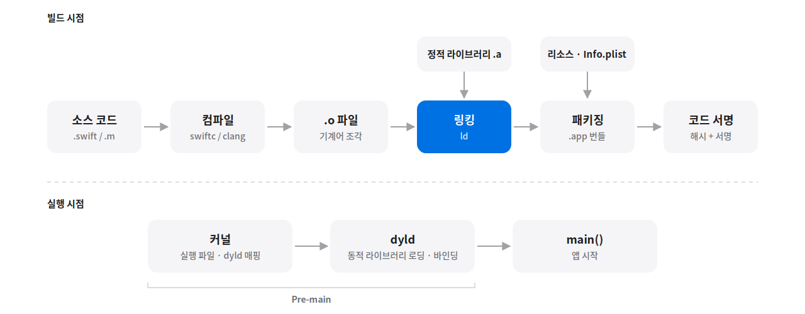

# iOS 빌드 과정

> 작성일: 2026-10-01

## 큰 그림

소스 코드가 기기에서 실행되기까지: **컴파일 → 링킹 → 패키징 → 코드 서명**(빌드 시점) → **로딩·동적 링킹**(실행 시점)



## 1. PreProcessor - 전처리기

- **목적:** 컴파일러에 제공할 수 있는 방식으로 프로그램을 변환하는 것
- Swift에는 C 같은 **별도 전처리 단계가 없음** (`#define` 텍스트 치환 불가)
- `#if` 조건 컴파일은 **Swift 컴파일러(swiftc)가 파싱하면서 직접 처리**
- `Build Settings > Active Compilation Conditions`는 조건값을 swiftc에 `-D` 플래그로 **넘겨주는 설정**
  - 예: Debug 구성 → `-D DEBUG`
- C/ObjC는 clang에 전처리 단계가 있음 → 설정은 `Preprocessor Macros`

| | C / ObjC (clang) | Swift (swiftc) |
|---|---|---|
| 전처리 단계 | 있음 (`#include`, `#define`, `#if`) | 없음 |
| 조건 컴파일 | 전처리기가 처리 | 컴파일러가 파싱 중에 처리 |
| Xcode 설정 | Preprocessor Macros (`GCC_PREPROCESSOR_DEFINITIONS`) | Active Compilation Conditions (`SWIFT_ACTIVE_COMPILATION_CONDITIONS`) |

### 전처리문 (조건 컴파일)

참/거짓을 판별해서 어떤 코드를 컴파일할지 결정합니다. `#`으로 시작합니다.

```swift
#if 조건
    source code..
#endif
```

```swift
// Xcode 기본 설정은 Debug 구성에만 DEBUG가 정의되어 있음 (RELEASE는 없음)
#if DEBUG
print("DEBUG에서만 할 코드")
#else
print("RELEASE에서 할 코드")
#endif
```

## 2. Compiler - 컴파일러

- Swift용: `swiftc`
- C 언어 계열(C / ObjC / C++)용: `clang`

### Swift는 AOT 컴파일

- JVM 같은 런타임이 중간에 없다
- 빌드 결과물이 곧 그 CPU 아키텍처용 기계어 → "이 CPU, 이 OS 전용" 바이너리 완성 → 실행 시점에 번역 X, 앱 시작이 빠름, 대신 범용성을 잃는다

### 타겟 트리플

컴파일러가 "무엇을 위해 만들지"를 지정하는 문자열

```
arm64 - apple - ios17.0 - simulator
  │       │        │          │
  │       │        │          └ 환경
  │       │        └ 최소 OS 버전
  │       └ 벤더
  └ CPU 아키텍처
```

- Apple Silicon Mac에서는 시뮬레이터와 실기기가 **CPU는 똑같이 arm64인데도 다른 산출물**이다. 맨 끝 `-simulator` 하나가 갈라놓는다
- Xcode가 빌드 세팅(아키텍처, SDK, `IPHONEOS_DEPLOYMENT_TARGET`)으로 트리플을 조립해 `swiftc -target …`으로 넘긴다 ([Xcode 프로젝트 구조와 빌드 설정](01_xcode-project-settings.md) 3번)

### 시뮬레이터용 빌드와 실기기용 빌드는 애초에 다른 산출물이다

| | 실기기 | 시뮬레이터 |
|---|---|---|
| 타겟 트리플 | `arm64-apple-ios` | `arm64-apple-ios-simulator` |
| SDK | `iphoneos` | `iphonesimulator` |
| 산출물 폴더 | `Debug-iphoneos` | `Debug-iphonesimulator` |
| 링크되는 시스템 프레임워크 | iOS 실물 | macOS 위에서 도는 iOS 구현체 |

- 산출물 폴더는 DerivedData의 `Build/Products/` 아래에 생긴다 ([Xcode 프로젝트 구조와 빌드 설정](01_xcode-project-settings.md) 4번)

## 3. Assembler - 어셈블러

- Assembly code를 **재배치 가능한 machine code**로 바꾼다 → Mach-O 파일(코드와 데이터의 모음) 생성 (구조는 4번)
- ⚠️ **개념상의 단계.** 실제 Xcode 빌드에서는 swiftc/clang 내부의 LLVM이 기계어까지 바로 생성하므로 어셈블러가 따로 실행되지 않음 (빌드 로그에 `as` 호출이 없음)

## 4. Linker - 링커

단일 Mach-O 실행 파일을 만들기 위해 다양한 `.o` 파일과 라이브러리를 병합하는 프로그램

- 어셈블러(컴파일) 단계 → **Relocatable Object File** 타입의 Mach-O 생성 (`.o`, Header 종류 `MH_OBJECT`)
- 링커 단계 → `Build Settings > Mach-O Type`에 따라 결과물 생성


| Mach-O Type | 만드는 도구 | 결과 | Header 종류 |
|---|---|---|---|
| Executable | `ld` | 앱 실행 파일 | `MH_EXECUTE` |
| Dynamic Library | `ld` | `.dylib` / 동적 `.framework` | `MH_DYLIB` |
| Static Library | `libtool` | `.a` / 정적 `.framework` — **링킹이 아니라 `.o`를 묶기만 함** | 없음 (Mach-O가 아니라 `.o` 묶음) |

### Mach-O 구조

Apple 플랫폼의 실행 파일 포맷. "Mach Object"의 줄임말, macOS의 뿌리인 Mach 커널에서 유래

- 포맷 → 기계어의 설명서. 기계어만 덜렁 있으면 OS가 그걸 어떻게 메모리에 올릴지 모른다

| OS | 포맷 |
|---|---|
| Apple (macOS/iOS) | **Mach-O** |
| Linux | ELF |
| Windows | PE (`.exe`, `.dll`) |

```
┌─────────────────┐
│ Header          │  종류(실행파일/라이브러리), CPU 아키텍처
├─────────────────┤
│ Load Commands   │  진입점, 의존 라이브러리 목록,
│                 │  최소 OS 버전, 코드 서명 위치
├─────────────────┤
│ __TEXT          │  기계어 코드, 상수 (읽기 전용)
│ __DATA          │  전역 변수 (읽기/쓰기)
└─────────────────┘
```

- **Header의 종류 필드** → `MH_EXECUTE`(실행 파일) / `MH_DYLIB`(동적 라이브러리). `file` 명령이 "executable"과 "shared library"를 구분해 찍어주는 근거. 위 표의 Mach-O Type 설정이 이 값으로 들어간다
- **Load Commands의 진입점** — 실행 파일에만 있고 라이브러리에는 없다. 둘을 가르는 기준은 Header의 종류 필드이고, 진입점 유무는 그 결과다
- **Load Commands의 의존 목록** — 여기 적힌 프레임워크의 실물이 번들에 없으면 `dyld: Library not loaded` (→ 7번)
- **최소 OS 버전** — 타겟 트리플의 `ios17.0`이 여기 박힌다 (→ 2번)
- **코드 서명 정보** — 서명(도장 + 인증서)이 붙는 자리 ([iOS 코드 서명](03_code-signing.md) 4번)

**직접 보기**

```bash
otool -h <바이너리>    # 헤더 (종류, 아키텍처)
otool -L <바이너리>    # 의존하는 라이브러리 목록
```

`otool -L`은 **내 앱이 실행되려면 기기에 뭐가 있어야 하는지**의 목록이다.

### .xcframework

2번에서 본 것처럼 시뮬레이터용과 실기기용은 다른 산출물이라, 링커는 타겟 트리플이 다른 바이너리를 묶지 못한다. 서드파티 라이브러리가 실기기용 바이너리만 담고 있으면 시뮬레이터에서 링크가 깨진다.

`.xcframework`는 여러 아키텍처·플랫폼용 바이너리를 한 묶음에 담아, 빌드할 때 맞는 걸 골라 쓰게 하는 배포 포맷이다. 소스 없이 컴파일된 라이브러리를 배포할 때 쓴다.

```
Alamofire.xcframework/
├── Info.plist                      ← 어느 폴더가 어느 조합용인지 목록
├── ios-arm64/
│   └── Alamofire.framework         ← 실기기용
├── ios-arm64_x86_64-simulator/
│   └── Alamofire.framework         ← 시뮬레이터용
└── macos-arm64_x86_64/
    └── Alamofire.framework
```

→ Xcode가 빌드 시 타겟 트리플을 보고 알맞은 폴더 하나를 고른다. 선택은 빌드 타임에 끝나고, `.app` 안에는 고른 것 하나만 들어간다.

**.xcframework가 프로젝트 파일에 없는 이유**

- `.xcframework`는 컴파일된 결과물을 남에게 건네줄 때 쓰는 포장
- 라이브러리라고 다 그런 건 아니고, 바이너리 형태로 전달된 라이브러리만 맞는 슬라이스를 골라야 함 → `.xcframework`
- 바이너리 형태 → 이미 컴파일된 것
- 소스로 주느냐, 바이너리를 주느냐. 바이너리로 주는 이유는 보통 둘 중 하나 → 소스를 공개하고 싶지 않거나(상용 SDK), 빌드가 오래 걸려서 미리 말아둔 것

### 실무에서

- 시뮬레이터에서만 `building for iOS Simulator, but linking in object file built for iOS` 같은 링크 에러가 나면(Xcode 버전마다 문구가 조금 다름), 라이브러리에 시뮬레이터용 슬라이스가 없다는 뜻이다 → `.xcframework`로 배포된 버전을 받는다

## 5. Xcode 빌드 버튼 클릭 후 전체 흐름


1. **Xcode - 프로젝트 해석 & 스킴(Scheme) 분석**
   - 프로젝트 파일(`.xcodeproj`)과 설정된 스킴을 확인한다.
   - 어떤 타깃들을 빌드해야 하는지, 빌드 전 실행할 스크립트(Pre-build action)가 있는지 확인한다.
2. **Xcode Build System - 빌드 설명서 생성**
   - 프로젝트 설정을 바탕으로 llbuild가 이해할 수 있는 빌드 그래프(Build Description / Task List)를 만든다.
   - "A 모듈 컴파일 → B 모듈 컴파일 → 링크" 같은 전체 작업 지시서를 만드는 과정이다. (빌드 로그의 Planning build 단계)
3. **llbuild 실행 - 실제 작업 스케줄링 및 총괄 감독**
   - 생성된 지시서를 바탕으로 Xcode에 내장된 llbuild를 호출한다.
   - 각 작업의 파일 변경 여부(증분 빌드 판단)를 체크하고, CPU 코어 수에 맞게 작업을 분배한다.
4. **컴파일러/도구 실행 - 실제 작업 수행**
   - llbuild가 순서에 맞춰 `swiftc`, `clang`, `ld`, `actool`, `ibtool` 같은 CLI 도구를 자식 프로세스로 실행한다.

### llbuild (Low-Level Build System)

- 컴파일러 동작 전·중·후 전체를 지휘하는 **외부 실행 엔진**
- 어떤 도구를, 어떤 파일에 대해, 무슨 순서로, 몇 개를 병렬로 실행할지 결정한다.
- 직접 코드를 변환하지 않고, `swiftc`나 `clang` 같은 CLI 도구를 자식 프로세스로 **호출 및 감시**한다.

```
1. [Xcode] 스킴/프로젝트 설정 분석 ➔ llbuild용 작업 지시서 생성
2. [llbuild] 실행 & 총괄 스케줄링 시작
   ├─► [swiftc/clang] ➔ .o 파일 생성 ➔ [링커(ld)] ➔ 실행 파일 ─┐
   │     (조건 컴파일·기계어 생성까지 컴파일러 내부에서 처리)    │
   └─► [actool/ibtool] ➔ 리소스 컴파일 ─────────────────────────┼─► .app 번들 조립 ➔ 코드 서명
```

> 소스 컴파일과 리소스 처리는 **병렬**로 진행되고, 리소스는 **링커를 거치지 않는다.** 링커의 입력은 `.o`와 라이브러리뿐이다.

## 6. 패키징

1. **실행 파일 배치** — 실제로는 링커가 처음부터 `.app` 내부 경로에 실행 파일을 씀
2. **리소스** → `.app` 내부로 이동
3. **동적 라이브러리/프레임워크 복사** → `.app/Frameworks/` (정적 라이브러리는 이미 실행 파일에 박제됨)
4. **Info.plist** 내용 + Xcode 빌드 설정 병합 → 최종 `Info.plist`
5. **프로비저닝 프로필 삽입** → 앱이 어떤 기기에서 실행될 수 있는지 `embedded.mobileprovision`으로 포함
6. **코드 서명** → `.app` 내부 파일들의 **해시**를 계산하고, 그 해시 목록에 **비밀키로 서명**
   - ⚠️ **암호화가 아님** → 내용은 그대로 읽을 수 있고, **위변조 여부만 검증**
   - 바이너리 암호화(FairPlay)는 App Store 업로드 후 Apple이 별도로 수행

### 완성된 `.app` 구조 예시

```
MyApp.app/
 ├─ MyApp                      ← 실행 파일 (Mach-O, 정적 라이브러리 코드 포함)
 ├─ Info.plist
 ├─ Assets.car                 ← actool이 컴파일한 에셋
 ├─ Base.lproj/Main.storyboardc
 ├─ Frameworks/
 │   └─ Foo.framework/Foo      ← 동적 프레임워크 (별도 Mach-O)
 ├─ embedded.mobileprovision
 └─ _CodeSignature/CodeResources   ← 파일별 해시 목록
```

─────── 여기까지 빌드 / 이후는 앱 실행 시점 ───────

## 7. Loader - 로더

설치되는 단위는 `.app` 폴더 전체(앱 번들), OS가 실제로 실행하는 건 그 안의 실행 파일 하나(앱 바이너리)

```
MyApp.app/        ← 이게 통째로 폰에 복사됨
└── MyApp         ← OS가 메모리에 올려 진입점부터 돌리는 건 이 파일
```

1. `.app` 폴더가 기기로 복사된다 (설치)
2. 아이콘을 탭한다
3. OS가 `Info.plist`를 읽어 "실행 파일 이름이 뭔지" 확인한다
4. 그 파일을 메모리에 올리고 진입점부터 실행한다

마지막 단계를 자세히 보면:

- 커널(XNU)이 앱 실행 파일과 **dyld**를 메모리에 **매핑**
  - 통째 복사가 아니라 매핑 → 실제 접근하는 페이지만 그때그때 읽음
- dyld가 `LC_LOAD_DYLIB`(Load Commands의 의존 목록)을 읽고 동적 라이브러리 로딩 → 빈칸(심볼) 채우기 → 초기화 → `main` 호출
- 이 구간이 **Pre-main 단계**

## 핵심 정리

> **빌드 시점:** 소스 → `.o`(컴파일) → 실행 파일(링킹) → `.app`(패키징) → 서명
>
> **실행 시점:** 커널이 매핑 → dyld가 동적 라이브러리를 연결 → `main`
>
> 링커는 빈칸(U)과 정의(T)를 짝짓고, 동적 링킹은 그 짝짓기를 실행 시점으로 미룬 것이다.
>
> **산출물의 형식:** `.o` · 실행 파일 · 동적 라이브러리는 모두 Mach-O다. Header가 종류를, Load Commands가 진입점·의존 목록·서명 위치를 담는다.
>
> 컴파일러는 **타겟 트리플** 하나를 위해 기계어를 만든다 → 시뮬레이터용과 실기기용은 다른 산출물이고, 미리 컴파일된 라이브러리는 `.xcframework`에 둘 다 담아 배포한다.

## 셀프 체크

**Q1. .app 안에는 뭐가 들어있나**

- 실행파일, Info.plist, Assets.car(컴파일된 에셋), Frameworks/(동적 프레임워크), embedded.mobileprovision(프로비저닝 프로필), `_CodeSignature/`(서명)

**Q2. 시뮬레이터 빌드와 실기기 빌드는 왜 다른 산출물인가**

- CPU가 아니라 **플랫폼**이 다르기 때문이다. Apple Silicon Mac에서는 둘 다 arm64지만, 타겟 트리플의 `-simulator`와 SDK(`iphonesimulator` / `iphoneos`)가 달라서 링크되는 시스템 프레임워크도 다르다

## 참고 자료

- WWDC22 — *Link fast: Improve build and launch times*
- WWDC22 — *Demystify parallelization in Xcode builds*
- WWDC19 — *Optimizing App Launch*
- Apple Developer Documentation — *Build settings reference*
