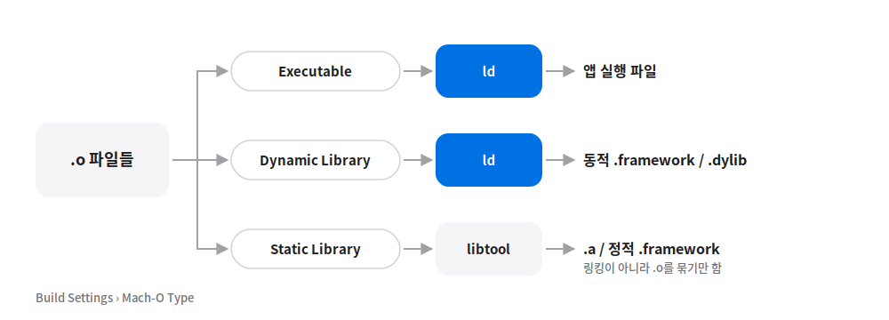
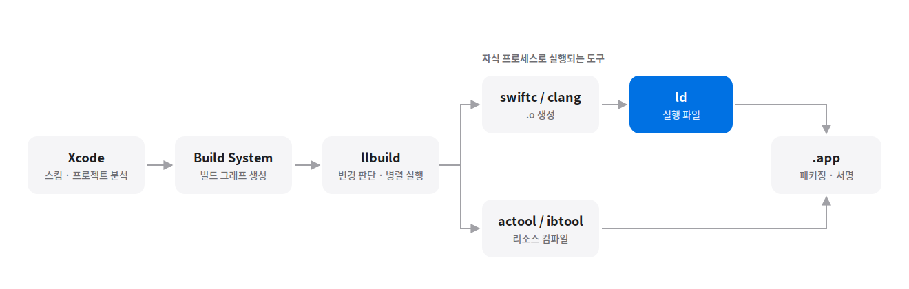

# iOS 빌드 과정

> 작성일: 2026-10-01

## 큰 그림

소스 코드가 기기에서 실행되기까지: **컴파일 → 링킹 → 패키징 → 코드 서명**(빌드 시점) → **로딩·동적 링킹**(실행 시점)


## 1. PreProcessor - 전처리기

- **목적:** 컴파일러에 제공할 수 있는 방식으로 프로그램을 변환하는 것
- Swift에는 C 같은 **별도 전처리 단계가 없음** (`#define` 텍스트 치환 불가)
- `#if` 조건 컴파일은 **Swift 컴파일러(swiftc)가 파싱하면서 직접 처리**
- `Build Settings > Active Compilation Conditions`는 조건값을 swiftc에 `-D` 플래그로 **넘겨주는 설정**
  - 예: Debug 구성 → `-D DEBUG`
- C/ObjC는 clang에 전처리 단계가 있음 → 설정은 `Preprocessor Macros`

| | C / ObjC (clang) | Swift (swiftc) |
|---|---|---|
| 전처리 단계 | 있음 (`#include`, `#define`, `#if`) | 없음 |
| 조건 컴파일 | 전처리기가 처리 | 컴파일러가 파싱 중에 처리 |
| Xcode 설정 | Preprocessor Macros (`GCC_PREPROCESSOR_DEFINITIONS`) | Active Compilation Conditions (`SWIFT_ACTIVE_COMPILATION_CONDITIONS`) |

### 전처리문 (조건 컴파일)

참/거짓을 판별해서 어떤 코드를 컴파일할지 결정합니다. `#`으로 시작합니다.

```swift
#if 조건
    source code..
#endif
```

```swift
// Xcode 기본 설정은 Debug 구성에만 DEBUG가 정의되어 있음 (RELEASE는 없음)
#if DEBUG
print("DEBUG에서만 할 코드")
#else
print("RELEASE에서 할 코드")
#endif
```

## 2. Compiler - 컴파일러

- Swift용: `swiftc`
- C 언어 계열(C / ObjC / C++)용: `clang`

## 3. Assembler - 어셈블러

- Assembly code를 **재배치 가능한 machine code**로 바꾼다 → Mach-O 파일(코드와 데이터의 모음) 생성
- ⚠️ **개념상의 단계.** 실제 Xcode 빌드에서는 swiftc/clang 내부의 LLVM이 기계어까지 바로 생성하므로 어셈블러가 따로 실행되지 않음 (빌드 로그에 `as` 호출이 없음)

## 4. Linker - 링커

단일 Mach-O 실행 파일을 만들기 위해 다양한 `.o` 파일과 라이브러리를 병합하는 프로그램

- 어셈블러(컴파일) 단계 → **Relocatable Object File** 타입의 Mach-O 생성 (`.o`)
- 링커 단계 → `Build Settings > Mach-O Type`에 따라 결과물 생성



| Mach-O Type | 만드는 도구 | 결과 |
|---|---|---|
| Executable | `ld` | 앱 실행 파일 |
| Dynamic Library | `ld` | `.dylib` / 동적 `.framework` |
| Static Library | `libtool` | `.a` / 정적 `.framework` — **링킹이 아니라 `.o`를 묶기만 함** |

## 5. Xcode 빌드 버튼 클릭 후 전체 흐름



1. **Xcode - 프로젝트 해석 & 스킴(Scheme) 분석**
   - 프로젝트 파일(`.xcodeproj`)과 설정된 스킴을 확인한다.
   - 어떤 타깃들을 빌드해야 하는지, 빌드 전 실행할 스크립트(Pre-build action)가 있는지 확인한다.
2. **Xcode Build System - 빌드 설명서 생성**
   - 프로젝트 설정을 바탕으로 llbuild가 이해할 수 있는 빌드 그래프(Build Description / Task List)를 만든다.
   - "A 모듈 컴파일 → B 모듈 컴파일 → 링크" 같은 전체 작업 지시서를 만드는 과정이다. (빌드 로그의 Planning build 단계)
3. **llbuild 실행 - 실제 작업 스케줄링 및 총괄 감독**
   - 생성된 지시서를 바탕으로 Xcode에 내장된 llbuild를 호출한다.
   - 각 작업의 파일 변경 여부(증분 빌드 판단)를 체크하고, CPU 코어 수에 맞게 작업을 분배한다.
4. **컴파일러/도구 실행 - 실제 작업 수행**
   - llbuild가 순서에 맞춰 `swiftc`, `clang`, `ld`, `actool`, `ibtool` 같은 CLI 도구를 자식 프로세스로 실행한다.

### llbuild (Low-Level Build System)

- 컴파일러 동작 전·중·후 전체를 지휘하는 **외부 실행 엔진**
- 어떤 도구를, 어떤 파일에 대해, 무슨 순서로, 몇 개를 병렬로 실행할지 결정한다.
- 직접 코드를 변환하지 않고, `swiftc`나 `clang` 같은 CLI 도구를 자식 프로세스로 **호출 및 감시**한다.

```
1. [Xcode] 스킴/프로젝트 설정 분석 ➔ llbuild용 작업 지시서 생성
2. [llbuild] 실행 & 총괄 스케줄링 시작
   ├─► [swiftc/clang] ➔ .o 파일 생성 ➔ [링커(ld)] ➔ 실행 파일 ─┐
   │     (조건 컴파일·기계어 생성까지 컴파일러 내부에서 처리)    │
   └─► [actool/ibtool] ➔ 리소스 컴파일 ─────────────────────────┼─► .app 번들 조립 ➔ 코드 서명
```

> 소스 컴파일과 리소스 처리는 **병렬**로 진행되고, 리소스는 **링커를 거치지 않는다.** 링커의 입력은 `.o`와 라이브러리뿐이다.

## 6. 패키징

1. **실행 파일 배치** — 실제로는 링커가 처음부터 `.app` 내부 경로에 실행 파일을 씀
2. **리소스** → `.app` 내부로 이동
3. **동적 라이브러리/프레임워크 복사** → `.app/Frameworks/` (정적 라이브러리는 이미 실행 파일에 박제됨)
4. **Info.plist** 내용 + Xcode 빌드 설정 병합 → 최종 `Info.plist`
5. **프로비저닝 프로필 삽입** → 앱이 어떤 기기에서 실행될 수 있는지 `embedded.mobileprovision`으로 포함
6. **코드 서명** → `.app` 내부 파일들의 **해시**를 계산하고, 그 해시 목록에 **비밀키로 서명**
   - ⚠️ **암호화가 아님** → 내용은 그대로 읽을 수 있고, **위변조 여부만 검증**
   - 바이너리 암호화(FairPlay)는 App Store 업로드 후 Apple이 별도로 수행

### 완성된 `.app` 구조 예시

```
MyApp.app/
 ├─ MyApp                      ← 실행 파일 (Mach-O, 정적 라이브러리 코드 포함)
 ├─ Info.plist
 ├─ Assets.car                 ← actool이 컴파일한 에셋
 ├─ Base.lproj/Main.storyboardc
 ├─ Frameworks/
 │   └─ Foo.framework/Foo      ← 동적 프레임워크 (별도 Mach-O)
 ├─ embedded.mobileprovision
 └─ _CodeSignature/CodeResources   ← 파일별 해시 목록
```

─────── 여기까지 빌드 / 이후는 앱 실행 시점 ───────

## 7. Loader - 로더

- 커널(XNU)이 앱 실행 파일과 **dyld**를 메모리에 **매핑**
  - 통째 복사가 아니라 매핑 → 실제 접근하는 페이지만 그때그때 읽음
- dyld가 `LC_LOAD_DYLIB`을 읽고 동적 라이브러리 로딩 → 빈칸(심볼) 채우기 → 초기화 → `main` 호출
- 이 구간이 **Pre-main 단계**

## 핵심 정리

> **빌드 시점:** 소스 → `.o`(컴파일) → 실행 파일(링킹) → `.app`(패키징) → 서명
> **실행 시점:** 커널이 매핑 → dyld가 동적 라이브러리를 연결 → `main`
>
> 링커는 빈칸(U)과 정의(T)를 짝짓고, 동적 링킹은 그 짝짓기를 실행 시점으로 미룬 것이다.

## 참고 자료

- WWDC22 — *Link fast: Improve build and launch times*
- WWDC22 — *Demystify parallelization in Xcode builds*
- WWDC19 — *Optimizing App Launch*
- Apple Developer Documentation — *Build settings reference*
