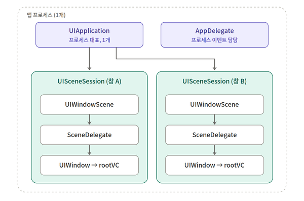

# AppDelegate와 SceneDelegate

> 작성일: 2026-09-29

앱이 실행되는 밑바닥 → AppDelegate 시대 → UIScene 등장 → 씬 구성요소와 라이프사이클 → 멀티씬 개념

## 1. 밑바닥: 앱 아이콘을 탭하면 무슨 일이 일어나나

프로세스가 시작되면 main() 함수 호출

@main이 대신 만들어주기 때문에 main.swift를 사용하지 않음

```swift
// @main이 대신 만들어주는 것과 같은 코드
UIApplicationMain(
    CommandLine.argc,
    CommandLine.unsafeArgv,
    nil,                                   // UIApplication 서브클래스 (보통 nil)
    NSStringFromClass(AppDelegate.self)    // delegate 클래스
)
```

UIApplicationMain이 하는 일:

1. UIApplication 싱글턴 생성 - 앱 프로세스 전체를 대표하는 객체 (UIApplication.shared)
2. AppDelegate 인스턴스 생성 후 UIApplication.delegate에 연결
3. Info.plist 읽기 (스토리보드, 씬 매니페스트 등)
4. 메인 런루프(Run Loop) 시작 - 터치, 타이머, 시스템 이벤트를 무한히 기다리고 처리하는 루프, 이 함수는 절대 리턴하지 않는다

핵심은 델리게이트 패턴

UIApplication은 Apple이 만든 클래스로서 수정할 수 없다 → "중요한 일이 생기면 알려줄게(delegate)" → 그 창구가 UIApplicationDelegate, 즉 AppDelegate

## 2. AppDelegate 시대 (iOS 12까지): 앱 = 창 하나

```swift
@main
class AppDelegate: UIResponder, UIApplicationDelegate {
    var window: UIWindow?   // ← 앱 전체에 창이 딱 하나

    func application(_ application: UIApplication,
                     didFinishLaunchingWithOptions launchOptions: [UIApplication.LaunchOptionsKey: Any]?) -> Bool {
        window = UIWindow(frame: UIScreen.main.bounds)   // ← 화면도 딱 하나
        window?.rootViewController = RootViewController()
        window?.makeKeyAndVisible()
        return true
    }
}
```

앱 상태도 앱 전체 단위로 하나

| 상태 | 의미 | 진입 시 AppDelegate 콜백 |
|---|---|---|
| Not Running | 프로세스 없음 | — |
| Inactive | 화면엔 보이지만 이벤트 못 받음 (전화 수신, 제어센터 등) | `applicationWillResignActive` |
| Active | 정상 사용 중 | `applicationDidBecomeActive` |
| Background | 화면에서 사라짐, 코드는 잠깐 실행 가능 | `applicationDidEnterBackground` |
| Suspended | 메모리엔 있지만 코드 실행 안 됨 (콜백 없음) | — |

AppDelegate는 두 종류의 책임을 섞어서 들고 있었다

- 프로세스 레벨 - 앱 시작, 푸시 토큰 등록, 백그라운드 fetch, 메모리 경고
- UI 레벨 - 창 만들기, 화면 활성/비활성, URL 열기, 상태 복원

## 3. UIScene 등장 (iOS 13, 2019)

iPadOS 13에서 "한 앱의 창을 여러 개 띄우기" 도입 → 기존 모델이 무너짐

- `var window: UIWindow?` — 창이 둘인데 어디에 담지?
- `applicationDidBecomeActive` — 창 A는 활성, 창 B는 뒤에 있는데 "앱이 active"라는 게 무슨 뜻?
- `UIScreen.main.bounds` — 창마다 크기가 다른데?

그래서 Apple은 AppDelegate의 두 책임을 쪼갠다

- 프로세스 레벨 → AppDelegate에 그대로 남음
- UI 레벨 → 새로 만든 UIScene / UISceneDelegate로 이동, 그리고 창마다 하나씩 존재

## 4. 멀티씬(창 2개)일 때 객체 구조



- UISceneSession - 창 하나에 대한 영속 정보, 앱이 꺼져도 시스템이 보관
  - 메모리가 부족하면 시스템은 백그라운드 창의 Scene을 해제하지만 Session은 남겨둔다. 사용자가 그 창을 다시 열면 Session 기반으로 Scene을 새로 만들어 복원한다.

## 5. 씬 라이프사이클

상태가 씬 단위로 존재 → 창 A와 창 B가 각자 다른 상태일 수 있음

| 씬 상태 | 의미 | 진입 시 SceneDelegate 콜백 | 예전 대응 |
|---|---|---|---|
| Unattached | 씬 객체 생성됨, 아직 화면 연결 전 | `scene(_:willConnectTo:options:)` | `didFinishLaunching`의 UI 부분 |
| Foreground Inactive | 화면에 보이지만 이벤트 X | `sceneWillEnterForeground` / `sceneWillResignActive` | 동일 이름의 `application...` |
| Foreground Active | 사용 중 | `sceneDidBecomeActive` | `applicationDidBecomeActive` |
| Background | 화면에서 사라짐 | `sceneDidEnterBackground` | `applicationDidEnterBackground` |
| Suspended | 코드 실행 정지 | — | — |
| (해제) | 시스템이 메모리 회수를 위해 씬 해제 | `sceneDidDisconnect` | 새로 생긴 개념 |

## 6. 앱 실행 순서 (싱글씬 기준)

1. main() → UIApplicationMain()
2. UIApplication 생성, AppDelegate 생성
3. AppDelegate.application(_:didFinishLaunchingWithOptions:) ← 프로세스 초기화 (SDK 설정 등)
4. AppDelegate.application(_:configurationForConnecting:options:) ← "어떤 설정으로 씬 만들까?" (plist로 대체 가능)
5. UIWindowScene 생성, SceneDelegate 생성
6. SceneDelegate.scene(_:willConnectTo:options:) ← 여기서 window 생성
7. sceneWillEnterForeground → sceneDidBecomeActive
