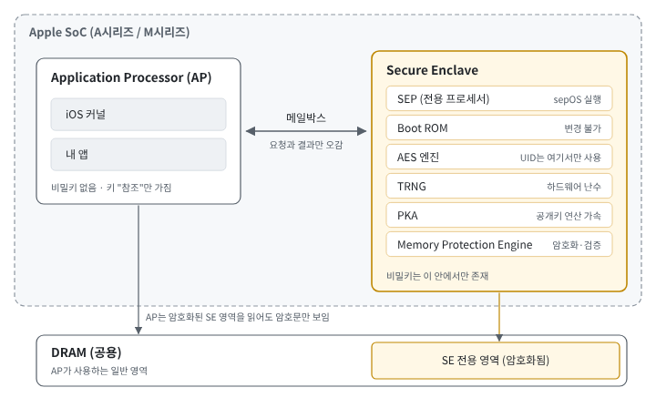

# iOS Secure Enclave

> 작성일: 2026-10-07

## 큰 그림

```
내 앱 (AP)  ── "이 키로 서명해 줘" ──▶  Secure Enclave
            ◀──── 서명값만 ─────────    (비밀키는 밖으로 안 나옴)
```

**Secure Enclave(SE)** = SoC 안에 AP와 분리된 보안 전용 하드웨어. 비밀키는 SE 안에서 생성되고 절대 밖으로 나오지 않는다

## 1. Secure Enclave는 무엇이고 왜 따로 있나

### ① 왜 필요한가: "커널이 털리면 끝"인 구조

```
iOS 보안(샌드박스, 코드 서명 검사, 권한) → 커널이 정상이라는 전제 위에 있음
Keychain 키 → 저장할 땐 암호화, 쓸 땐 AP 메모리에 복호화됨
탈옥 → 커널 장악 → 메모리를 읽을 수 있음 → 키 노출

→ 커널이 장악당해도 지켜지는 영역이 필요
→ 소프트웨어로는 불가능 → SoC 안에 분리된 하드웨어 → Secure Enclave
→ 결과: 키를 꺼낼 수 없음, 공격자에게 남는 건 "서명 요청"뿐
```

- 도입: iPhone 5s(A7, 2013), Touch ID와 함께. 첫 용도는 지문 데이터 보호

### ② 하드웨어 구조: 칩 안의 또 다른 컴퓨터



| 구성 요소 | 역할 |
|---|---|
| **SEP** | SE 전용 프로세서. 일부러 낮은 클럭으로 동작해 전력·클럭 조작 공격(글리칭)에 강하게 설계 |
| **sepOS** | SE 위에서 도는 별도 OS. iOS와 코드를 공유하지 않음 |
| **Boot ROM** | 제조 때 새겨진 변경 불가능한 코드. SE 신뢰의 출발점 |
| **AES 엔진** | 기기 고유 UID 키를 쓰는 유일한 통로. 소프트웨어(sepOS 포함)는 UID 값을 직접 읽지 못함 |
| **TRNG** | 키 생성용 하드웨어 난수. 키 품질의 바탕 |
| **PKA** | P-256 서명, ECDH 같은 공개키 연산 전담 |
| **Memory Protection Engine** | SE가 쓰는 메모리를 암호화·검증 |

### ③ 메모리 분리: 같은 DRAM을 쓰지만 AP는 못 읽는다

SE는 별도의 RAM 칩이 없고 기기의 DRAM 일부를 빌려 쓴다. 안전한 이유는 Memory Protection Engine 때문이다.

```
SE가 메모리에 쓸 때
SEP → [Memory Protection Engine: 암호화 + 무결성 태그] → DRAM 전용 영역

AP(또는 공격자)가 그 영역을 읽으면
→ 암호문만 보임
→ 값을 바꿔 넣으면 SE가 읽을 때 무결성 검사 실패 → 감지
```

### ④ 통신: 메일박스로 요청과 결과만 오간다

AP와 SE는 서로의 메모리를 직접 건드리지 않는다 → 메일박스와 공유 버퍼로만 대화한다.

```
내 앱
 → Security / CryptoKit 프레임워크
   → iOS 커널의 SE 드라이버
     → 메일박스: "키 #7로 이 해시에 서명해 줘"
                                          → SE: 접근 조건 확인
                                          → SE: 비밀키로 서명
     ← 메일박스: "서명값은 3045022…"
 ← 앱은 서명값만 받음
```

- 비밀키를 AP로 보내는 메시지가 아예 존재하지 않는다 → 막아 둔 게 아니라 기능 자체가 없다
- 커널을 장악한 공격자도 할 수 있는 일은 "서명해 줘"라고 요청하는 것뿐이다
- SE는 생체 매칭 결과를 스스로 확인한다 → AP가 "인증 통과했어"라고 속여도 믿지 않는다

### ⑤ 별도 부팅: SE도 Apple 도장을 확인하고 켜진다

SE는 iOS와 따로 부팅하고, 코드 서명의 "Apple 공개키로 도장 확인"을 그대로 사용한다.

```
전원 ON
 ├─ AP 쪽:  AP Boot ROM → iBoot → iOS 커널         (각 단계가 다음 단계 서명 확인)
 │                         │
 │                         └─ sepOS 이미지를 메모리에 올려 SE에 넘김
 │
 └─ SE 쪽:  SE Boot ROM
             → 메모리 암호화 임시 키 생성
             → sepOS의 Apple 서명 확인 (Boot ROM에 새겨진 Apple 공개키로)
             → ✅ 통과하면 실행 / ❌ 실패하면 SE 사용 불가
```

### 실무에서

- 시뮬레이터에는 SE가 없음 → `SecureEnclave.isAvailable`이 `false`, 키 생성 실패. SE 동작 확인은 실기기에서
- 탈옥 기기에서도 SE 키 생성·서명은 정상 동작함 → SE는 "키가 안 털린다"를 보장할 뿐, 조작된 앱이 엉뚱한 데이터에 서명을 요청하는 것은 못 막음

## 2. Secure Enclave 안에 있는 것들

- **UID**: 제조 시 SoC에 새겨진 기기 고유 키. 누구도 읽을 수 없고 SE AES 엔진만 쓸 수 있어서, UID로 감싼 데이터는 그 기기에서만 풀린다
- **보안 저장소**: 패스코드 실패 횟수처럼 되돌리면 안 되는 값을 담는 별도 칩(A12+). 플래시 복제·복원(롤백) 공격을 막는다
- **Data Protection**: 파일, Keychain을 잠금 상태에 따라 등급별로 암호화하는 체계. 그 키들도 SE가 UID로 관리한다
- **Face ID 데이터**: 얼굴 매칭은 SE 안에서 일어나고, iOS는 "통과/실패" 결과만 받는다

## 3. 앱이 SE 키를 만들고 쓰는 과정

순서: ① 키 생성 → ② blob과 저장 → ③ 접근 조건 → ④ 서명할 때 일어나는 일

### ① 키 생성

```
앱: "SE에 P-256 키 만들어 줘 + 접근 조건"
 → SE: 난수로 비밀키 생성 → SE 안에 둠
 → 앱에 돌아오는 것: 공개키 + 키 참조(blob 또는 Keychain 항목)
앱: 공개키 → 서버 등록
```

- 앱이 받는 것에 비밀키는 없다 → 이후 모든 사용은 "참조"를 통해 SE에 요청하는 방식
- API는 CryptoKit(iOS 13+)과 Security 프레임워크(`SecKey`) 두 가지. 같은 SE를 쓰며 보안 수준은 같다

### ② blob과 저장

```
SE 안: 비밀키
 → SE가 UID 기반 키로 감쌈 (+ 접근 조건 정보)
 → blob = "이 기기 SE만 풀 수 있는 포장된 비밀키"
 → 앱이 받아서 저장
```

- blob은 비밀키가 아니라 다른 기기에선 무의미하지만, 같은 기기에서 유출되면 서명 "요청"에 쓰일 수 있다
- 그래서 blob도 아무 데나 두지 않고 Keychain + `ThisDeviceOnly`로 저장한다

### ③ 접근 조건 (SecAccessControl)

```
키 생성 시:  비밀키 + 접근 조건 → 함께 포장 (blob)
                                     ↓
서명 요청 시: SE가 조건 확인 → Face ID 필요? → 매칭 결과도 SE 안에서 확인
                          → 통과하면 서명 / 실패하면 거부
```

```swift
let access = SecAccessControlCreateWithFlags(
    nil,
    kSecAttrAccessibleWhenUnlockedThisDeviceOnly,   // 언제 (잠금 상태)
    [.privateKeyUsage, .biometryCurrentSet],        // 누가 (사용자 확인)
    nil
)!
```

- 금융권 앱은 보통 `.biometryCurrentSet`을 쓰고, 생체 변경 시 "재인증 후 다시 등록" 플로우를 둔다. 정책 결정 사항이라 보안팀·서버와 맞춰야 한다
- 접근 조건은 처음 설계할 때 정해야 하며, 나중에 정책을 바꾸면 모든 사용자 키를 다시 등록해야 한다

### ④ 서명할 때 일어나는 일

```
1. blob → 키 복원           (Face ID 안 뜸, 아직 SE에 요청 전)
2. signature(for: data)    ← 여기서 호출 스레드가 멈춤
   → SE: 접근 조건 확인 → Face ID 프롬프트 표시
   → 사용자 얼굴 → SE 안에서 매칭
   → 통과: data를 SHA-256 해시 → 비밀키로 서명
3. 서명값 반환              (사용자가 인증할 때까지 2번에서 대기)
```

LAContext로 프롬프트 제어 가능

```swift
let context = LAContext()
context.localizedReason = "결제를 승인합니다"   // 프롬프트 문구 (지원 버전·동작은 실기기 확인 필요)

let key = try SecureEnclave.P256.Signing.PrivateKey(
    dataRepresentation: blob,
    authenticationContext: context
)
let signature = try key.signature(for: payload)   // 여기서 Face ID
```

### 실무에서

**앱을 삭제해도 Keychain 항목은 남는다**

iOS는 앱 삭제 시 샌드박스(UserDefaults 포함)는 지우지만 Keychain 항목은 남겨 둔다.

```
앱 삭제 → 재설치
 ├─ UserDefaults: 비어 있음
 └─ Keychain: 예전 blob 그대로 있음
     → 앱은 "등록된 기기"로 판단
     → 그런데 서버에서는 이미 등록 해제됐을 수 있음 → 서명 검증 실패
```

흔한 대응: 첫 실행 여부를 UserDefaults에 표시하고, 첫 실행이면 Keychain의 예전 키를 지우고 재등록한다.

**메인 스레드에서 호출하지 않기**

`signature(for:)`는 동기 함수이고, 사용자가 Face ID를 끝낼 때까지 리턴하지 않는다.

**자주 만나는 실패**

| 증상 | 원인 |
|---|---|
| 실기기에서도 키 생성 실패 | 접근 조건에 `.privateKeyUsage` 누락 (SE 키에 필수) |
| 서버가 공개키·서명 파싱 실패 | 형식 불일치. CryptoKit `derRepresentation`은 DER, Security 공개키는 raw → 서버와 형식을 먼저 합의 |
| Face ID 재등록 후 서명 실패 | `.biometryCurrentSet` 키 무효화 (정상 동작) → 재등록 |

## 4. 할 수 있는 연산 / 없는 연산

SE 키로 할 수 있는 건 서명, 키 합의(ECDH), 복호화(ECIES) 세 가지뿐이다 (P-256).

**핵심 포인트: 보호받는 건 비밀키뿐이다**

ECDH나 ECIES를 쓰면 SE 키에서 시작하지만, 결과로 나온 대칭키와 평문은 AP 메모리에 있다.

```
서명       → 결과(서명값)는 공개돼도 되는 값           → 문제없음
ECDH/ECIES → 결과(대칭키, 평문)가 AP 메모리에 나옴      → 커널 장악 시 노출 가능
```

### 실무에서

결제에서 각각 언제 쓰나

- 서명: 기기 바인딩, 거래 승인 → 거의 항상 사용
- 대부분의 결제 연동은 TLS + SE 서명으로 충분하다

## 5. 기기에 묶인다는 것의 의미

SE 키는 이 기기 + (조건에 따라) 지금의 생체정보에 묶여 있다. 둘 중 하나가 바뀌면 키를 못 쓰게 되고, 그때마다 재등록이 필요하다.

```
정상:        앱 키(blob) ✅ + 서버 공개키 ✅ → 서명·검증 성공
키가 깨짐:    앱 키 ❌ → 서명 불가 → 재등록
상태 불일치:  앱 키 ✅ + 서버 공개키 ❌ → 서명은 되지만 검증 실패 → 재등록
```

### 실무에서

**재등록이 가장 약한 고리**

```
공격자 입장:
SE 키를 훔치는 건 불가능 → 대신 "내 기기를 새로 등록"하는 게 쉬움
→ 재등록 절차가 약하면 SE를 쓴 의미가 없어짐
```

그래서 재등록은 최초 등록과 같거나 더 강한 본인 확인(비밀번호 + 본인인증 등)을 요구해야 한다.

**SE가 보장하지 못하는 것** (결제 보안 설계 때 별도 주제로)

| SE가 보장하는 것 | SE가 보장하지 못하는 것 | 메우는 방법 |
|---|---|---|
| 비밀키는 기기 밖으로 안 나간다 | 조작된 앱이 엉뚱한 데이터에 서명을 요청 | 거래 내용 서명 |
| 서명은 이 기기·이 사용자만 할 수 있다 | 변조되지 않은 진짜 앱인지 | App Attest |
| 접근 조건은 SE가 직접 검사한다 | 공격자 기기가 재등록되는 것 | 강한 재등록 절차 |

## 핵심 정리

1. SE는 SoC 안의 **독립된 보안 하드웨어**다. 커널이 장악돼도 비밀키는 밖으로 나오지 않고, 공격자에게 남는 건 "서명 요청"뿐이다.
2. SE 안의 모든 것은 **UID**에 묶여 있어, 그 기기를 벗어나면 풀리지 않는다.
3. 앱은 공개키와 참조(blob)만 받고, 서명할 때마다 **SE가 접근 조건을 직접 검사**한다. 접근 조건은 나중에 바꿀 수 없다.
4. SE가 보호하는 건 **비밀키뿐**이다. 그래서 결제 보안의 주력은 결과가 공개돼도 되는 **서명**이다.
5. SE 키는 기기·생체정보에 묶여 있어 **재등록이 정상 흐름**이고, 재등록은 공격자가 노리는 가장 약한 고리다.

## 셀프 체크

**Q1. UID와 UDID, UUID는 어떻게 다른가?**

- UID는 숨기고 쓰기만 하는 **비밀 암호화 키**, UDID·UUID는 보여 주고 비교하는 **식별자**다. UDID는 프로비저닝 프로필의 기기 목록에 쓰이는 기기 식별자이고(앱은 읽을 수 없음), UUID는 128비트 식별자 형식이다(`UUID()`, `identifierForVendor`).

**Q2. UID는 다른 기기로 가기 전에만 의미가 있는가?**

- 아니다. UID로 감싼 데이터가 이 기기 안에서만 의미가 있는 것이다. UID는 같은 기기에서도 저장 칩을 떼어 내 읽는 공격, 패스코드를 다른 컴퓨터로 옮겨 무차별 대입하는 공격을 막는다. UID = 데이터를 이 기기에 묶는 닻.

**Q3. 결제 앱이 SE 키로 기기를 등록했는데, 사용자가 새 iPhone으로 백업을 복원했다. 결제 서명이 될까?**

- 안 된다. `ThisDeviceOnly`로 저장했다면 blob 자체가 복원되지 않고, 복원되더라도 UID가 다른 새 기기의 SE는 풀 수 없다. 재등록이 필요하다.

## 참고 자료

- Apple Platform Security Guide — *Secure Enclave*
- Apple Platform Security Guide — *Boot process for iOS and iPadOS devices*
- Apple Platform Security Guide — *Data Protection overview*
- Apple Developer Documentation — *Protecting keys with the Secure Enclave*
- Apple Developer Documentation — *SecureEnclave.P256.Signing.PrivateKey*
- Apple Developer Documentation — *SecAccessControlCreateFlags*
- Apple Developer Documentation — *Storing CryptoKit Keys in the Keychain* (샘플 코드)
- Apple Developer Documentation — *LAContext*
