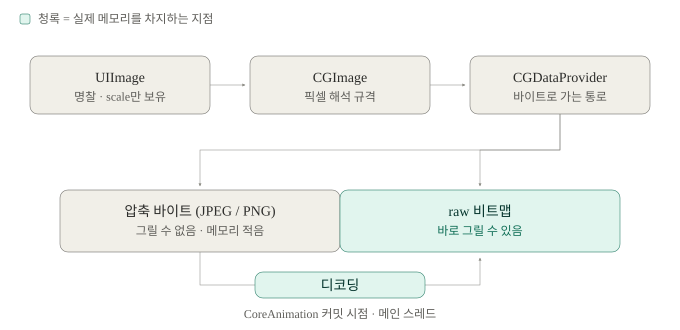
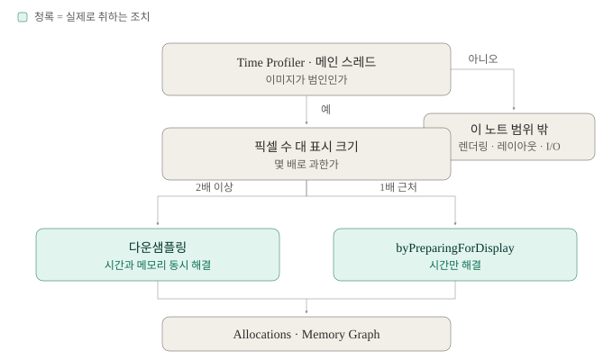

# UIImage와 이미지 메모리

이미지 한 장이 메모리와 시간을 어디서 쓰는가, 그 지점을 어떻게 옮길 수 있는가.

| 단계 | 내용 | 상태 |
|---|---|---|
| 1 | UIImage 구조 · scale · 디코딩 | ✅ |
| 2 | 다운샘플링 · 생성자별 캐싱 | ✅ |
| 3 | 진단 순서 | ✅ |
| 4 | SDWebImage 내부 | ⚪️ 별도 노트 |

## 결론

- 메모리는 픽셀 수 × 4로 정해진다. 파일 크기·압축률과는 무관하다 → 파일 크기와 메모리 크기
- 디코딩은 대입 시점이 아니라 CoreAnimation 커밋 때, 메인 스레드에서 일어난다 → 디코딩 — 언제, 얼마나
- 흔한 리사이즈는 원본 전체를 디코딩한다. ImageIO로 애초에 작게 푼다 → 다운샘플링
- 순서가 있다: 먼저 픽셀을 줄이고, 그 다음 디코딩 시점을 옮긴다 → 디코딩 — 언제, 얼마나
- 버벅임은 순간의 비용, 메모리 경고는 누적 총량 — 다른 문제다. 이미지가 범인인지 확정부터 → 진단 순서

---

## UIImage는 무엇을 들고 있는가

> UIImage는 이미지가 아니라 이미지를 가리키는 명찰이다.

명찰에 적힌 건 사실상 두 줄이다. **실물이 어디 있는지**(CGImage), **몇 배로 그려야 하는지**(scale). 픽셀은 UIImage 안에 없다.



CGImage는 "픽셀을 해석하는 규격"을 고정한 것이다. `width`, `height`(픽셀), `bytesPerRow`, `bitsPerPixel`, `bitmapInfo` 같은 값들. 같은 바이트 열이라도 이 규격이 없으면 그림이 되지 않는다. 규격과 바이트 중 한쪽만 바뀌어도 깨지기 때문에 CGImage는 immutable이고, 바꾸려면 새로 만들게 되어 있다.

그 아래 `CGDataProvider`가 실제 바이트로 가는 통로인데, **바이트가 두 상태 중 하나**라는 것이 이 노트 전체의 출발점이다.

압축 상태는 JPEG·PNG 바이트가 그대로 있는 것이라 디코딩 전에는 그릴 수 없고, raw 상태는 펼쳐진 비트맵이라 바로 그릴 수 있다.

두 상태의 CGImage는 겉보기 필드가 똑같다. `cg.width`, `cg.bytesPerRow` 모두 정상값이 나온다. 그래서 코드로 계산한 `bytesPerRow * height`는 **"디코드되면 이만큼 될 것"** 이지 지금 쓰고 있는 양이 아니다.

여기서 바로 나오는 실무 결론이 하나 있다. 여러 UIImage가 같은 CGImage를 공유할 수 있다는 것.

```swift
let base = UIImage(named: "card")
let a = base?.withRenderingMode(.alwaysTemplate)
let b = base?.withRenderingMode(.alwaysOriginal)
// UIImage 3개, 실제 픽셀은 1벌
```

| 하는 일 | 새 픽셀 | 비용 |
|---|---|---|
| `withRenderingMode`, `withTintColor` | ✗ | 거의 0 |
| `UIImage(cgImage:scale:orientation:)` | ✗ | 거의 0 |
| `UIGraphicsImageRenderer`로 다시 그리기 | ✓ | 픽셀 수만큼 |

### 정리

- UIImage는 명찰, 픽셀은 CGImage 아래에 있다
- CGImage는 바이트 + 해석 규격을 고정한 immutable 객체
- 명찰을 복제하는 건 싸고, 실물을 새로 그리는 건 비싸다
- `bytesPerRow * height`는 잠재 크기이지 현재 점유량이 아니다

---

## scale · point · pixel

> scale은 곱하는 값이 아니라 나누는 값이다.

`@3x`는 iOS가 이미지를 3배로 늘려주는 기능이 아니다. 디자이너가 애초에 300×300으로 만들어 넣은 파일을 iOS가 **나눠서** point로 환산하는 것이다.

```
size(point) = CGImage 픽셀 크기 ÷ scale
```

논리 크기 100pt 하나에 대해 밀도별 파일이 **서로 독립적으로** 존재한다.

| 슬롯 | 파일 픽셀 | `image.scale` | `image.size` |
|---|---|---|---|
| 1x | 100×100 | 1.0 | 100×100 |
| 2x | 200×200 | 2.0 | 100×100 |
| 3x | 300×300 | 3.0 | 100×100 |

`size`가 어느 기기에서든 같기 때문에 레이아웃 코드가 픽셀을 몰라도 된다. 그리고 **셋 중 하나만 로드된다.** 3x 기기는 360KB, 2x 기기는 160KB — 같은 앱인데 기기에 따라 이미지 메모리가 2배 차이 난다.

`size`는 저장된 값이 아니라 매번 나눠서 나오는 결과다. 그래서 픽셀을 하나도 안 건드려도 `size`만 바꿀 수 있다.

```swift
let cg = UIImage(named: "icon")!.cgImage!   // 300×300 픽셀
UIImage(cgImage: cg, scale: 3, orientation: .up).size  // 100×100
UIImage(cgImage: cg, scale: 1, orientation: .up).size  // 300×300
```

**흔한 사고** — 300×300 파일을 1x 슬롯에 넣으면 `scale`이 1.0, `size`가 300×300이 되어 intrinsicContentSize가 3배로 잡힌다. "이 아이콘만 유독 크다"의 단골 원인.

### 서버에서 받은 이미지

`UIImage(data:)`는 **무조건 scale 1.0**이다. 파일명에 `@3x`가 있든, 서버가 어떤 크기로 저장했든 알 방법이 없다. scale을 정하는 건 항상 클라이언트다.

서버가 정하는 건 픽셀을 몇 개 줄지까지고, 그 픽셀을 몇 pt로 볼지는 클라이언트의 몫이다.

두 방식이 갈린다.

- **A. 밀도별로 다른 파일** — 요청에 배율을 실어 보내고 `UIImage(data:, scale: UIScreen.main.scale)`. asset 카탈로그와 같은 구조, 저사양 기기는 트래픽·메모리 절약. 서버가 배율별 파일을 갖고 있어야 함
- **B. 한 벌만 내려받기** — 서버는 3x 기준 한 벌, 클라이언트는 `scale: 3` 고정. 서버가 단순하고 레이아웃이 기기 불문 일정. 대신 2x 기기도 큰 파일을 디코드

B에서 `UIScreen.main.scale`을 쓰면 안 된다. 2x 기기에서 `300 ÷ 2 = 150pt`가 되어 로고 크기가 기기마다 달라진다. scale은 화면 밀도가 아니라 **"이 파일이 몇 픽셀로 1pt를 표현하기로 약속했는가"** 이기 때문이다.

> [!TIP]
> 표시 크기가 정해진 로고라면 `contentMode = .scaleAspectFit` + 제약으로 고정하는 쪽이 안전하다. `size`가 뭐든 레이아웃이 안 깨진다. 단 이건 레이아웃만 해결하고 메모리는 그대로다.

### 정리

- `@3x`는 확대가 아니라 밀도별 별개 파일 중 선택
- `size`는 저장값이 아니라 `픽셀 ÷ scale`의 결과
- `UIImage(data:)`는 항상 scale 1.0 — 서버가 대신 정해줄 수 없다
- 서버 이미지는 "몇 픽셀 기준으로 올린다"를 규약으로 문서화해야 함

---

## 파일 크기와 메모리 크기

> 압축은 디스크와 네트워크만 아낀다.

```
bytes = bytesPerRow × height ≈ pixelWidth × 4 × pixelHeight
```

JPEG 품질을 낮춰 3MB를 300KB로 줄여도, 픽셀 수가 같으면 메모리는 1바이트도 안 줄어든다.

| 픽셀 | 비트맵 |
|---|---|
| 300×300 | 0.35MB |
| 1200×1200 | 5.8MB |
| 4032×3024 | 46.5MB |

`bytesPerRow`가 항상 `width × 4`는 아니다. CGContext가 만든 비트맵은 행 정렬용 패딩이 붙는 경우가 있고, 그레이스케일이면 `bitsPerPixel`이 8, wide color면 64가 나온다. 계산할 때는 `bytesPerRow`를 직접 읽는 쪽이 정확하다.

### 정리

- 200KB PNG라도 2000×2000이면 메모리에서는 16MB

---

## 디코딩 — 언제, 얼마나

> 압축 바이트를 raw 비트맵으로 펼치는 작업. 로드할 때가 아니라 그려질 때 일어난다.

```swift
let image = UIImage(contentsOfFile: path)   // 아직 압축 상태
imageView.image = image                     // 아직도 압축 상태
// 런루프 끝, CoreAnimation 커밋              // 여기서 펼쳐짐
```

`imageView.image = image` 시점에도 디코딩은 없다. UIImageView는 명찰을 레이어에 꽂아둘 뿐이다. 실제 디코딩은 **CoreAnimation이 커밋할 때, 메인 스레드에서** 일어난다. GPU가 압축 바이트를 못 읽으니 그 자리에서 펼치는 것.

비용은 두 종류다. 시간은 픽셀 수에 비례하는 CPU 연산이고, 메모리는 `width × height × 4`가 새로 잡힌다.

프레임 예산은 60fps에서 16.7ms, 120Hz에서 8.3ms다. 46MB짜리 사진 디코딩이 수십 ms면 프레임을 그냥 놓친다.

> [!IMPORTANT]
> 비용이 **셀 생성 시점이 아니라 표시 시점**에 붙는다. 다운로드를 백그라운드로 잘 빼놔도 디코딩은 여전히 메인 커밋에 남는다. "비동기 로딩을 했는데도 스크롤이 끊긴다"의 원인.

확인은 이렇게.

```swift
let start = CACurrentMediaTime()
imageView.image = image
CATransaction.flush()   // 커밋 강제 = 디코딩 강제
print("\((CACurrentMediaTime() - start) * 1000) ms")
```

`flush()`가 없으면 대입만 재는 거라 0에 가깝게 나온다. 이 차이 자체가 "디코딩은 대입 시점이 아니다"의 증명이다.

### 정리

- 디코딩은 없앨 수 없다. 시점을 옮기거나 양을 줄이는 것만 가능
- 시간은 프레임 하나를 놓치고 끝나지만 메모리는 앱을 죽인다

| | 시간 | 메모리 |
|---|---|---|
| 시점 옮기기 | 해결 | 그대로 |
| 양 줄이기 | 해결 | 해결 |

---

## 인코딩 구조가 만드는 결과

> 코덱 내부는 몰라도 되지만, 두 가지 성질은 코드 선택을 바꾼다.

PNG는 이웃 픽셀과의 차이를 기록하는 무손실 방식이라 단색·아이콘·로고와 알파에 강하고, JPEG는 사람 눈이 둔한 정보를 버리는 손실 방식이라 사진에 강하다.

여기서 실무에 걸리는 성질 세 가지.

**1. 디코딩은 순차적이라 부분만 풀 수 없다.** PNG는 윗줄이 복원돼야 아랫줄이 나오고, JPEG는 압축 비트에 경계 표시가 없다. 그래서 디코딩 비용이 파일 크기가 아니라 **픽셀 수**로 정해진다.

**2. 헤더만 읽는 건 거의 공짜다.** 폭·높이가 압축 데이터 앞에 평문으로 있다.

```swift
let src = CGImageSourceCreateWithURL(url as CFURL, nil)!
let props = CGImageSourceCopyPropertiesAtIndex(src, 0, nil) as! [CFString: Any]
let w = props[kCGImagePropertyPixelWidth] as! Int
// 픽셀 한 개도 안 펼침
```

업로드된 이미지가 과한지 검수하는 데 그대로 쓸 수 있다.

**3. JPEG는 줄여서 디코딩할 수 있다.** 블록별로 "큰 흐름"과 "미세한 변화"가 분리 저장되어 있어서, 미세한 쪽을 안 풀고 큰 흐름만 복원하면 1/2·1/4 크기가 전체 디코딩보다 훨씬 싸게 나온다. 다음 절의 근거.

### 정리

- 디코딩 비용 = 픽셀 수 (파일 크기 아님)
- 헤더만 읽어 크기 검사하는 건 공짜에 가깝다
- JPEG는 작게 푸는 것이 구조적으로 가능하다

---

## 다운샘플링

> 만들었다 줄이는 게 아니라, 애초에 작게 푸는 것.

흔한 리사이즈 코드는 결과물만 작을 뿐 비용을 다 지불한다.

```swift
let image = UIImage(contentsOfFile: path)!          // 전체 디코딩 5.8MB
let small = renderer.image { _ in                    // 축소 0.35MB
    image.draw(in: CGRect(origin: .zero, size: target))
}
```

축소본을 만들려면 원본을 먼저 그려야 하므로 **피크 메모리에 5.8MB가 반드시 찍힌다.** 4032×3024면 이 순간 46MB가 잡혔다 풀리고, 여러 장이 겹치면 그 자리에서 죽는다.

ImageIO에 직접 물리면 중간 단계가 아예 생기지 않는다.

```swift
func downsample(url: URL, to pointSize: CGSize, scale: CGFloat) -> UIImage? {
    let srcOptions = [kCGImageSourceShouldCache: false] as CFDictionary
    guard let src = CGImageSourceCreateWithURL(url as CFURL, srcOptions) else { return nil }

    let maxPixel = max(pointSize.width, pointSize.height) * scale
    let options = [
        kCGImageSourceCreateThumbnailFromImageAlways: true,
        kCGImageSourceShouldCacheImmediately: true,
        kCGImageSourceCreateThumbnailWithTransform: true,
        kCGImageSourceThumbnailMaxPixelSize: maxPixel
    ] as CFDictionary

    guard let cg = CGImageSourceCreateThumbnailAtIndex(src, 0, options) else { return nil }
    return UIImage(cgImage: cg, scale: scale, orientation: .up)
}
```

다섯 옵션이 전부 이유가 있다. 각 옵션의 의미는 [레퍼런스](#레퍼런스)에 정리했다.

> [!WARNING]
> `ShouldCacheImmediately`를 빼면 백그라운드에서 다운샘플링을 해놓고도 디코딩은 메인 스레드에 그대로 남는다.

이 옵션 때문에 이 함수는 **반드시 백그라운드에서** 불러야 의미가 있다.

```swift
Task.detached(priority: .userInitiated) {
    let image = downsample(url: url, to: CGSize(width: 100, height: 100),
                           scale: await UIScreen.main.scale)
    await MainActor.run { imageView.image = image }
}
```

여기서 `scale`에 화면 밀도를 넣는 게 맞는 이유는, `pointSize × scale`로 픽셀을 직접 뽑았으니 그 결과물이 정의상 그 배율짜리이기 때문이다. 서버 이미지 케이스와 다른 지점.

Data만 있으면 `CGImageSourceCreateWithData`를 쓴다. 다만 URL 버전은 mmap이 가능한 반면 Data 버전은 압축 바이트가 이미 메모리에 다 있는 상태다. 큰 이미지는 디스크에 먼저 쓰고 URL로 처리하는 쪽이 유리하다.

### 언제 하지 않는가

- **Asset 카탈로그 이미지** — 이미 화면 크기에 맞게 들어갔다. `UIImage(named:)`에 하면 손해만 본다
- **표시 크기가 원본과 비슷할 때** — 이득 없음
- **원본이 필요할 때** — 확대·편집 기능

쓸모 있는 건 **원본 픽셀 수를 통제할 수 없는 이미지**다. 서버에서 받은 것, 앨범에서 고른 것, 카메라로 찍은 것.

### 정리

- `CGImageSourceCreateThumbnailAtIndex`는 중간 비트맵을 만들지 않는다
- `ShouldCacheImmediately: true` + 백그라운드 호출이 한 세트

---

## 세 생성자와 캐싱 · Assets.car

> 캐싱 여부만 다른 게 아니라, 애초에 다른 저장소에서 꺼낸다.

| | 캐시 | 두 번 로드하면 |
|---|---|---|
| `UIImage(named:)` | 시스템이 캐싱 | 두 번째는 캐시에서 |
| `UIImage(contentsOfFile:)` | 없음 | 매번 새 비트맵 |
| `UIImage(data:)` | 없음 | 매번 새 비트맵 |

### Assets.car는 파일이 아니다

`Assets.xcassets`의 개별 PNG는 앱 번들에 그대로 들어가지 않고 `Assets.car` 한 덩어리로 컴파일된다. 그래서 asset 카탈로그에 넣은 이미지는 경로가 **존재하지 않는다.** `.car`가 만들어지는 과정은 [Xcode 빌드 파이프라인](Xcode 빌드 파이프라인.md)의 번들 조립 단계에 있다.

```swift
Bundle.main.path(forResource: "icon", ofType: "png")  // nil
```

`UIImage(named:)`는 `.car`를 먼저 뒤지고, 없으면 번들의 loose 파일을 찾는다. 어느 쪽에 넣었든 `named:`가 동작하는 이유이자 헷갈리는 원인.

`.car`는 인덱스를 가진 데이터베이스에 가깝다. 통째로 읽지 않고 현재 조건(scale, idiom, light/dark 등)에 맞는 **변형**만 꺼낸다. 여기서 두 가지가 따라온다.

- **App Thinning** — App Store가 기기에 맞는 변형만 담아 전달. 3x 기기는 2x 데이터를 받지 않는다. loose 파일은 이 최적화를 못 받는다
- **다크모드 자동 전환** — `named:`가 반환한 UIImage는 `imageAsset`을 들고 있어 트레이트 변경에 반응한다. `UIImage(data:)`로 만든 건 반응하지 않는다

### named: 캐시

시스템이 관리하며 접근·삭제 불가. 캐시 키는 이름 + 트레이트 조합이라 라이트/다크가 각각 캐시된다. 메모리 경고 때 UIKit이 정리한다.

> [!IMPORTANT]
> 강한 참조를 들고 있으면 캐시가 비워져도 그 이미지는 안 사라진다. 캐시는 "다음에 빨리 주려고" 들고 있는 것이고, 실제 해제는 참조 카운트가 결정한다.

### 그래서 무엇을 쓰나

| 상황 | 선택 |
|---|---|
| 아이콘·버튼, 반복 등장 | `named:` — 캐시가 이득 |
| 큰 이미지, 한 번 쓰고 버림, 여러 장 | loose 파일 + `contentsOfFile:` |
| 서버에서 받은 것 | `data:` 또는 다운샘플링 |

다만 `contentsOfFile:`로 넘어가는 대가가 작지 않다.

| 잃는 것 | 결과 |
|---|---|
| App Thinning | 1x/2x/3x가 전부 앱에 담김 |
| scale 자동 선택 | `logo@3x.png`를 경로로 열어도 scale 1.0 |
| 다크모드 자동 전환 | 트레이트 변경에 반응 안 함 |

`contentsOfFile:`에는 scale 인자가 없어서 정확히 하려면 한 겹 더 필요하다.

```swift
let data = try Data(contentsOf: URL(fileURLWithPath: path))
let image = UIImage(data: data, scale: UIScreen.main.scale)
```

> [!CAUTION]
> 측정 없이 구조를 바꾸는 건 대체로 손해다. 카탈로그를 벗어나는 비용은 확실한데 아끼는 메모리는 불확실하다. 표지 한 장이면 `named:` 그대로 두는 쪽이 낫고, 무겁다면 원인이 캐싱이 아니라 픽셀 수일 가능성이 크다.

`.car`에 실제로 뭐가 들었는지 확인하는 명령은 [레퍼런스](#레퍼런스)에.

### 정리

- asset 카탈로그 이미지는 경로가 없다. `named:`로만 접근
- `.car`는 조건에 맞는 변형만 꺼내는 인덱스 구조 — App Thinning과 다크모드가 여기서 나온다
- `named:` 캐시는 우리가 비울 수 없지만, 강한 참조가 없으면 정리될 여지가 있다
- `contentsOfFile:`은 제어권을 얻고 카탈로그 이점을 잃는 거래

---

## 진단 순서

> "스크롤이 끊긴다"는 최소 네 갈래다. 이미지가 범인인지부터 확정한다.



### 1단계 — 범인 확정

Time Profiler를 **메인 스레드로 필터링**하고 스크롤한다. 이 심볼이 보이면 디코딩이다.

```
CA::Layer::prepare_commit
  └ CA::Layer::copy_image
      └ CGImageProviderCopyImageBlockSetWithOptions
          └ AppleJPEGDecode / copyImageBlockSetPNG
```

없으면 다른 원인 — 오프스크린 렌더링(`cornerRadius` + `masksToBounds`, shadow), 레이아웃 계산, 메인 스레드 I/O. 이 노트 범위 밖.

### 2단계 — 픽셀이 과한가

```swift
if let cg = image.cgImage {
    let needed = imageView.bounds.width * UIScreen.main.scale
    print("표시: \(Int(needed))px / 실제: \(cg.width)px")
}
```

2배 이상이면 다운샘플링, 1배 근처면 타이밍 문제다.

### 3단계 — 타이밍이라면

```swift
Task.detached(priority: .userInitiated) {
    let ready = await image.byPreparingForDisplay()   // 여기서 디코딩
    await MainActor.run { cell.imageView.image = ready }
}
```

동기 버전 `preparingForDisplay()`를 메인에서 부르면 의미가 없다. 그리고 비동기가 끼면 **셀 재사용 처리가 반드시 따라와야** 한다.

```swift
guard cell.tag == indexPath.row else { return }
```

없으면 빠르게 스크롤할 때 엉뚱한 이미지가 잠깐 보인다. 프리페치도 같은 갈래인데, 타이밍만 해결하므로 픽셀이 과하면 오히려 메모리 압박을 앞당긴다.

### 메모리 경고는 다른 문제

버벅임은 순간의 비용, 메모리 경고는 누적된 총량이다. 디코딩을 백그라운드로 옮겨도 총량은 그대로.

| 갈래 | 확인 |
|---|---|
| 이미지가 안 풀린다 | Allocations의 `VM: ImageIO_*`, `CG raster data` — 화면을 나와도 안 줄면 참조가 남은 것 |
| 한 번에 너무 많이 든다 | 배열에 미리 다 로드하는 코드 |
| 개별 이미지가 과하다 | 다운샘플링으로 회귀 |

Debug Memory Graph는 누가 붙잡고 있는지 참조 경로를 화살표로 보여줘서 Allocations보다 빠를 때가 많다.

> [!NOTE]
> 메모리 경고를 받는 것 자체가 이미 늦은 신호다. `didReceiveMemoryWarning`에서 캐시를 비우는 건 응급처치.

### 정리

- 이미지가 범인인지 먼저 확정한다 — 원인이 그림자였던 경우가 흔하다
- 비동기 디코딩에는 셀 재사용 가드가 한 세트
- 안 풀리는 원인은 캐시보다 우리 코드의 강한 참조인 경우가 많다

---

## 레퍼런스

### 다운샘플링 옵션

| 옵션 | 의미 |
|---|---|
| `ShouldCache: false` | 원본 디코딩 결과를 캐싱하지 않게. 안 하면 원본이 메모리에 남아 목적이 사라짐 |
| `CreateThumbnailFromImageAlways` | EXIF 썸네일 대신 원본에서 생성. `IfAbsent`면 카메라가 넣은 160px이 나올 수 있음 |
| `ShouldCacheImmediately` | **호출한 스레드에서** 디코딩까지 끝냄 |
| `ThumbnailMaxPixelSize` | 긴 변 기준 최대 픽셀, 비율 유지 |
| `CreateThumbnailWithTransform` | EXIF 회전을 픽셀에 반영. 없으면 세로 사진이 눕는다 |

### Assets.car 내용 확인

```bash
xcrun --sdk iphoneos assetutil --info Assets.car > assets.json

python3 -c "
import json
d = json.load(open('assets.json'))
imgs = [x for x in d if x.get('AssetType') == 'Image']
imgs.sort(key=lambda x: x.get('PixelWidth',0)*x.get('PixelHeight',0), reverse=True)
for x in imgs[:20]:
    print(f\"{x.get('PixelWidth')}x{x.get('PixelHeight')} {x.get('Scale')}x  {x.get('Name')}\")
"
```

---

## 미확인 사항

- `UIImage(named:)` 캐시의 축출 정책 — 메모리 경고 시 전부 비우는지, LRU로 일부만인지, 임계값이 얼마인지는 문서화되어 있지 않다
- `named:` 캐시가 압축 상태를 저장하는지 디코드된 비트맵을 저장하는지 — 아직 그려지지 않은 이미지는 압축 상태일 것으로 보이나 확인 못 함
- PNG에서 `ThumbnailMaxPixelSize` 다운샘플링이 JPEG 대비 얼마나 이득인지 — ImageIO 내부 구현이라 실측 필요
- 디코딩 시간 수치(1200×1200 = 수 ms 등)는 대략적인 스케일이며 기기·포맷·품질에 따라 다름

---

## 다음

- SDWebImage 내부 — 메모리 캐시와 디스크 캐시에 각각 무엇을 저장하는지 (별도 노트)
