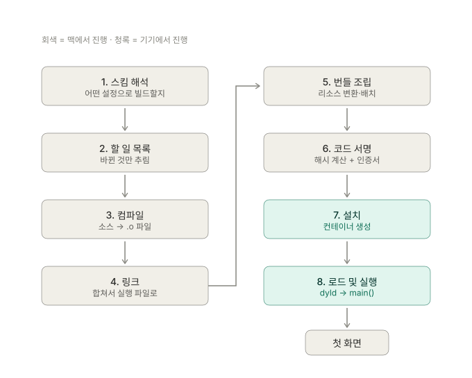

# Xcode 빌드 파이프라인

Xcode에서 Run 버튼을 누르면 앱이 실행되기까지 무슨 일이 일어나는가.


1~6번은 맥에서, 7~8번은 기기에서 벌어진다. 빌드 로그에 남는 건 6번까지다.

---

## 1. 스킴과 빌드 설정

> Run 버튼을 누르면 컴파일이 아니라 **"이번에 뭘 어떻게 빌드할지" 결정**부터 한다.

### 스킴은 설정이 아니라 선택지 묶음

Xcode 좌상단의 `▶ Ggcard > iPhone 15`에서 앞쪽이 스킴이다. 코드도 설정값도 아니고, **어떤 상황에서 어떤 설정을 쓸지 적어둔 메모**에 가깝다.

같은 앱이라도 목적에 따라 다르게 빌드해야 하기 때문에 존재한다.

| 목적 | 원하는 것 |
|------|-----------|
| 개발 중 실행 | 빠른 빌드, 디버깅 가능, 개발 서버 |
| 테스트 | 테스트 타겟 포함 |
| 앱스토어 제출 | 최적화, 디버그 정보 제거, 운영 서버 |

매번 손으로 바꾸면 사고가 난다. 운영 빌드에 개발 서버 주소가 들어가는 식으로. 그래서 액션별로 미리 나눠둔다.

```
Build   Run   Test   Profile   Analyze   Archive
```

Edit Scheme(`⌘<`)에서 각 액션에 Build Configuration을 따로 지정한다. Run은 기본 Debug, Archive는 기본 Release.

Run 버튼을 누른 순간 Xcode의 판단:

> Run 액션이고, 이 스킴의 Run은 Debug 구성이고, 대상은 iPhone 15이고, 환경변수는 이것들이다.

### 설정값은 4겹으로 쌓인다

스킴은 "Debug를 써라"까지만 말한다. **Debug의 내용은 Build Settings에 있다.**

같은 설정 항목이 여러 곳에 존재할 수 있고, 위에 값이 있으면 아래는 무시된다.

```
Target Build Settings      ← 가장 셈
     ↑ 없으면
Project Build Settings
     ↑ 없으면
xcconfig 파일
     ↑ 없으면
Xcode 기본값
```

**공통은 한 곳에, 예외만 개별로** 두기 위한 구조다. 앱이 하나면 의미 없지만 타겟이 20개쯤 되면 이게 없으면 관리가 불가능하다. 번들 ID만 다르고 나머지 300개 설정이 같은데 매번 다 적을 수는 없다.

| 층 | 넣는 것 |
|----|---------|
| xcconfig | 여러 타겟이 공유하는 값 |
| Project | 프로젝트 전체 기본값 |
| Target | 이 타겟만의 예외 (번들 ID, 앱 이름) |

> [!WARNING]
> Target Build Settings에 값을 직접 넣으면 xcconfig를 덮어쓴다. Xcode UI에서는 그냥 값이 보일 뿐이라 잘 드러나지 않아서, xcconfig를 고쳤는데 반영이 안 되는 상황이 생긴다. 항목을 클릭하면 어느 층에서 온 값인지 확인할 수 있다.

### 정리

- 스킴은 설정값이 아니라 **액션별로 어떤 Configuration을 쓸지 정해둔 메모**
- Run은 기본 Debug, Archive는 기본 Release
- 설정값 우선순위: **Target > Project > xcconfig > 기본값**. 위에 있으면 아래는 무시
- 이 구조의 목적은 **공통은 한 곳에, 예외만 개별로**. 타겟이 많을수록 필수
- Target에 직접 넣은 값이 xcconfig를 가린다 → "xcconfig 고쳤는데 반영 안 됨"의 원인

---

## 2. 할 일 목록 만들기

> 빌드 전에 **"전부 다시 만들 필요는 없다"** 를 계산하는 단계.

### 증분 빌드

바뀐 것만 다시 빌드하는 것. 반대말은 클린 빌드.

```
클린 빌드   68개 파일 전부 컴파일   →  3분
증분 빌드   1개만 컴파일            →  10초
```

이전 결과를 DerivedData에 남겨두고 재활용한다.

| 용어 | 뜻 |
|------|-----|
| 증분 빌드 | 변경분만 다시 빌드 |
| 클린 빌드 | 전부 다시 (`⇧⌘K` 후 빌드) |
| DerivedData | 이전 결과가 쌓이는 곳. 지우면 다음은 클린 빌드 |

"DerivedData 지우니까 해결됐다"는 증분 빌드 판단이 꼬였을 때 캐시를 통째로 버리는 대처다. 자주 그래야 한다면 그 자체가 문제 신호다.

### 판단 방식

모든 작업을 입력 → 출력 쌍으로 표현한다.

```
LoginViewController.swift  →  LoginViewController.o
Assets.xcassets            →  Assets.car
[모든 .o 파일들]            →  Ggcard
```

각 작업마다 이렇게 판단한다.

> 출력이 이미 있고, 입력이 그 이후로 안 바뀌었으면 → 건너뛴다

"안 바뀌었다"의 기준에 **컴파일 옵션도 포함된다.** 설정만 바꿔도 전체 빌드가 도는 이유다.

### Swift가 까다로운 이유

C 계열은 파일 하나가 독립적이다. `#include`로 의존 관계가 소스에 명시되어 있다.

Swift는 헤더가 없다. 같은 모듈 안이면 `import` 없이 다른 파일의 타입을 그냥 쓴다. 편하지만 대가가 있다.

```swift
// User.swift 를 고쳤다면 어느 파일이 영향받는가?
struct User {
    let name: String
    let age: Int    // ← 추가
}
```

`User`를 쓰는 파일을 전부 찾아야 하는데, 어디서 쓰는지 소스에 안 적혀 있다. 그래서 컴파일러가 매번 **"이 파일은 어떤 타입을 정의하고 어떤 타입을 참조한다"** 를 별도로 기록해두고, 다음 빌드에서 그걸로 영향 범위를 계산한다.

결과적으로 Swift 증분 빌드는 C보다 부정확하다. 보수적으로 판단해서 실제론 영향 없는 파일까지 다시 컴파일하는 경우가 생긴다.

### Run Script Phase

빌드 도중에 끼워 넣는 셸 스크립트. Build Phases 탭에서 `+` → New Run Script Phase로 추가하고, 목록 순서대로 실행된다.

```
▸ Dependencies
▸ Compile Sources
▸ Link Binary With Libraries
▸ Copy Bundle Resources
▸ Embed Frameworks
```

Xcode가 기본 제공하지 않는 작업에 쓴다. 빌드 번호 자동 증가, SwiftLint, 빌드 시각 기록 등. CocoaPods나 Firebase를 설치하면 `[CP] Embed Pods Frameworks` 같은 이름으로 자동 추가된다.

**Input Files / Output Files 칸이 핵심이다.** 빌드 시스템 입장에서 스크립트는 블랙박스라 뭘 읽고 쓰는지 모른다. 비워두면 이렇게 판단한다.

> 뭘 하는지 모르겠다 → 매번 실행한다

그리고 뒤따르는 작업까지 연쇄로 다시 돈다.

```
Input Files:   $(SRCROOT)/config/settings.json
Output Files:  $(DERIVED_FILE_DIR)/Generated.swift
```

이렇게 적어두면 입력이 안 바뀌었을 때 건너뛴다.

다만 **전부 채워야 하는 건 아니다.**

| 스크립트 성격 | 대응 |
|---------------|------|
| 파일을 생성 (코드 생성, 버전 갱신) | 채우면 실제로 빨라짐 |
| 검사만 함 (SwiftLint) | 비워두는 게 맞음. Output을 억지로 만들면 검사를 건너뛰게 됨 |
| CocoaPods/Firebase가 넣은 것 | 손대지 않음 |

> [!TIP]
> 빌드 시간 문제는 추측하지 말고 Report Navigator(`⌘9`) → 최근 빌드 → Build Timeline부터 본다. 각 작업이 몇 초 걸렸는지 막대로 나온다. 대부분 원인은 스크립트가 아니라 컴파일 자체거나 특정 파일 하나다.

### 정리

- **증분 빌드** = 바뀐 것만 다시 빌드. 반대는 클린 빌드
- 판단 기준은 입력 → 출력 쌍. 출력이 있고 입력이 그대로면 건너뜀
- **컴파일 옵션도 입력에 포함** → 설정만 바꿔도 전체 빌드가 돈다
- Swift는 헤더가 없어 파일 간 의존을 소스에서 알 수 없다 → 컴파일러가 별도 기록. 그래서 C보다 부정확하고 보수적으로 넓게 재컴파일
- Run Script Phase의 Input/Output이 비면 **매번 실행 + 뒤따르는 작업까지 연쇄 재실행**
- 단, 검사형 스크립트(SwiftLint)는 비워두는 게 맞다. 채우면 검사를 건너뛴다
- 빌드 시간은 추측 금지, Build Timeline부터

---

## 3. 컴파일

> 소스가 기계어로 바뀐다. 다만 **아직 실행할 수 있는 형태는 아니다.**

### 파일 단위로 쪼개는 이유

`LoginViewController.swift` → `LoginViewController.o` 처럼 파일마다 하나씩 나온다.

```
파일 68개 → .o 68개  →  합쳐서 실행 파일 하나
             ↑
        여기까지가 3단계
```

한 파일을 고치면 그 `.o` 하나만 다시 만들고 나머지는 재활용한다. **컴파일을 잘게 쪼갠 덕분에 증분 빌드가 성립한다.**

`.o`는 `.app`이 아니라 `Build/Intermediates.noindex/`에 남는다. 앱에 들어갈 물건이 아니라 다음 단계의 재료다.

### `.o`가 실행되지 않는 이유

```swift
let user = UserManager.shared.currentUser
```

`UserManager`는 다른 파일에 있는데, 컴파일러는 지금 이 파일 하나만 보고 있다. **주소를 알 수 없다.** 그래서 `.o`에는 이렇게만 적힌다.

```
"UserManager.shared" 라는 이름의 무언가를 호출함
→ 주소는 나중에 채워주세요
```

이 "나중에"가 4단계다. 컴파일과 링크가 나뉜 이유가 이것이다.

### 컴파일러가 하는 세 가지

1. **문법 검사** — 괄호, 세미콜론 수준
2. **타입 검사** — Swift에서 가장 비싼 단계
3. **코드 생성** — 실제 기계어

타입 추론은 편하지만 경우의 수가 많으면 조합이 폭발한다.

```swift
let x = items.filter { $0.count > 3 }.map { $0.name }
```

`The compiler is unable to type-check this expression in reasonable time` 에러가 여기서 나온다.

> [!TIP]
> 느린 함수를 찾으려면 Build Settings → Other Swift Flags에 `-Xfrontend -warn-long-function-bodies=500`. 500ms 넘는 함수를 경고로 알려준다. 대개 해결책은 타입 명시다.

### 정리

- 산출물은 `.o` (오브젝트 파일). 파일 단위로 하나씩
- 파일 단위로 쪼갠 덕분에 증분 빌드가 가능하다
- 다른 파일의 심볼 주소를 모르므로 **`.o` 단독으로는 실행 불가**
- 빌드가 느릴 때 범인은 대개 타입 추론
- 바이너리 = 기계가 읽는 형식의 파일. 앱 문맥에서는 대개 컴파일된 실행 파일

---

## 4. 링크

> 흩어진 `.o`를 합치고, **비워둔 주소를 채워** 실행 파일 하나를 만든다.

### 링크 에러가 컴파일 에러와 다른 이유

링커는 소스를 보지 않는다. 이미 기계어가 된 `.o`들만 본다. 그래서 파일명과 줄 번호를 알려주지 못한다.

| 에러 | 뜻 |
|------|-----|
| Undefined symbol | 이름을 찾았는데 없음. 파일을 타겟에 안 넣었거나 라이브러리 누락 |
| Duplicate symbol | 같은 이름이 둘. 어느 걸 쓸지 모름 |

### 정적 링크와 동적 링크

라이브러리도 여기서 붙는다. 붙는 방식이 둘이다.

| | 정적 (static) | 동적 (dynamic) |
|---|---|---|
| 링크 시점 | 코드를 바이너리에 **복사** | 이름만 기록 |
| 실행 시점 | 이미 안에 있음 | **dyld가 찾아서 로드** |

정적은 지금 다 끝내는 방식, 동적은 실행 시점으로 미루는 방식이다.

동적이 존재하는 원래 이유는 **메모리 공유**다. 앱 100개가 UIKit을 각자 복사해 갖고 있으면 메모리에 100벌이 올라간다. 동적이면 한 벌만 올려두고 공유한다. 시스템 프레임워크가 전부 동적인 이유다.

> [!IMPORTANT]
> **우리가 임베드한 프레임워크는 공유되지 않는다.** 우리 앱만 쓴다. 메모리 이득은 없고 실행 시점 로딩 비용만 남는다.

### 트레이드오프

| | 정적 | 동적 |
|---|------|------|
| 앱 실행 시간 | 빠름 | 느림 |
| 바이너리 크기 | 큼 | 작음 |
| 빌드 시간 | 느림 | 빠름 |

"정적이면 빠르다"의 대상은 **앱 실행(pre-main)**이다. 이미 로드된 뒤의 사용 중 성능은 사실상 차이가 없다.

### 무엇이 정적이고 무엇이 동적인가

성격이 아니라 **어떻게 받았느냐**로 갈린다.

| 출처 | 결정권 |
|------|--------|
| 시스템 (UIKit, Foundation) | 항상 동적 |
| 벤더 SDK — 바이너리 배포 | 벤더가 정함. **대부분 동적** |
| 오픈소스 — 소스 배포 | 우리가 정함 |

CocoaPods는 `use_frameworks!` 유무로, SPM은 기본 자동으로 결정된다.

### 실측 — 경기지역화폐

```bash
otool -L "$APP/Ggcard.debug.dylib" | grep @rpath
ls "$APP/Frameworks"
```

`@rpath`로 시작하면 앱 번들 안에 있는 것(동적), `/usr/lib/`는 시스템이다.

- 직접 참조 17개, `Frameworks/` 폴더에는 **24개**
- 차이는 간접 의존 — `MapboxCommon`, `FirebaseAnalytics` 등은 다른 프레임워크가 끌어온다
- RxSwift, SnapKit, Alamofire는 목록에 없다 → **정적으로 링크됨**
- Kona 계열, 광고 SDK, Mapbox·Routo 계열은 전부 동적

> [!NOTE]
> Debug 빌드에는 `Ggcard.debug.dylib`이 끼어 있다. Xcode가 증분 빌드를 빠르게 하려고 앱 코드를 별도 dylib으로 빼고 실행 파일은 껍데기만 남기는 것이다. **Release 빌드에는 없다.** 그래서 `otool -L`을 실행 파일에 걸면 이 dylib 하나만 보인다.

### 정리

- 링커는 소스를 안 본다 → 링크 에러에 줄 번호가 없다
- **정적** = 빌드 때 복사. 바이너리 커지고 실행 빠름
- **동적** = 이름만 기록, 실행 때 dyld가 로드. 바이너리 작고 실행 느림
- 동적의 원래 목적은 메모리 공유. **임베드한 것은 공유되지 않아 이득이 없다**
- 정적/동적은 라이브러리 성격이 아니라 **배포 형태**로 갈린다
- 산출물은 `Ggcard.app/Ggcard` (Mach-O 실행 파일)

---

## 5. 번들 조립

> 실행 파일만으로는 앱이 되지 않는다. 리소스를 정해진 자리에 배치한다.

### `.app`은 폴더다

Finder에서 파일 하나로 보이지만 디렉터리다. 우클릭 → 패키지 내용 보기로 열린다.

```
Ggcard.app/
├── Ggcard              ← 4단계 산출물
├── Info.plist
├── Assets.car
├── Base.lproj/
└── Frameworks/         ← 동적 프레임워크 24개
```

```bash
open -R "$APP"    # Finder에서 열기
ls -la "$APP"
```

### 리소스는 원본 그대로 들어가지 않는다

| 원본 | 결과 |
|------|------|
| `.xcassets` | `Assets.car` 하나로 뭉쳐짐 |
| `.storyboard` | `.storyboardc` (안에 `.nib`) |
| `Info.plist` (XML) | 바이너리 plist + 변수 치환 |

```bash
head -c 100 "$APP/Info.plist"      # bplist00... 깨져 보임
plutil -p "$APP/Info.plist"        # 정상 출력
```

전부 **실행 시점을 빠르게 하려는 것**이다. XML 파싱과 파일 탐색은 느리고, 어차피 빌드 때 한 번 하면 되는 일이다. `UIImage(named:)`가 파일 시스템을 뒤지지 않고 `Assets.car`를 조회하는 이유다.

### Asset Catalog에 들어가는 것

`actool`은 코드를 분석하지 않는다. **`.xcassets`에 있으면 안 쓰는 이미지도 전부 들어간다.**

```swift
let name = "icon_\(type)"
UIImage(named: name)
```

이런 코드가 가능해서 어떤 이미지가 쓰이는지 정적으로 알 수 없기 때문이다. 오래 운영한 앱은 여기에 미사용 이미지가 쌓인다.

`.xcassets` 밖에 두고 Copy Bundle Resources로 넣은 이미지는 개별 파일 그대로 남는다. 서드파티 SDK 리소스가 대개 이쪽이다.

```bash
xcrun assetutil --info "$APP/Assets.car" | head -40
```

> [!NOTE]
> `Assets.car`에는 다 들어가지만 사용자가 받는 건 다르다. **App Thinning**이 앱스토어에서 기기별로 잘라 배포한다. 로컬 `Assets.car`가 50MB여도 실제 다운로드는 그보다 작을 수 있다.

### 정리

- `.app`은 파일이 아니라 디렉터리
- 리소스는 변환되어 들어간다 — 전부 실행 시점을 빠르게 하려는 것
- `.xcassets`의 이미지는 **사용 여부와 무관하게 전부** `Assets.car`로
- Embed Frameworks에서 동적 프레임워크가 `Frameworks/`로 복사된다
- 이 시점의 `.app`은 서명이 없어 기기에 설치할 수 없다

---

## 6. 코드 서명

> **누가 만들었고 그 뒤로 변조되지 않았음**을 증명한다.

iOS의 전제는 "검증되지 않은 코드는 실행하지 않는다"이다. 우회할 수 없으므로 선택이 아니라 필수 단계다.

서명이 하는 일은 둘이다.

1. **변조 검증** — 모든 파일의 해시를 계산해둔다. 하나라도 바뀌면 실행이 거부된다
2. **신원 증명** — Apple이 발급한 인증서로 서명한다

### 등장인물 셋

| 이름 | 정체 | 비유 |
|------|------|------|
| 인증서 (Certificate) | 개발자 신원 | 신분증 |
| Entitlements | 앱이 **요청하는** 권한 | 신청서 |
| Provisioning Profile | Apple이 **허가한** 내용 | 허가증 |

Provisioning Profile에 적힌 것: 이 앱 ID는 / 이 인증서로 서명할 수 있고 / 이 권한을 쓸 수 있고 / 이 기기들에 설치할 수 있다.

> [!CAUTION]
> **요청했는데 허가에 없으면** 설치가 거부된다 — 에러가 나므로 바로 안다.
> **허가에는 있는데 요청하지 않으면** 설치는 되고 그 기능만 조용히 동작하지 않는다. 푸시가 안 오는데 에러도 없는 상황이 이것이다. 배포 후에야 발견되므로 훨씬 위험하다.

### 서명 순서는 안쪽부터

```
Frameworks/*.framework   ← 먼저
       ↓
Ggcard.app               ← 나중
```

바깥을 먼저 서명하면 안쪽을 서명하는 순간 파일이 바뀌어 바깥 해시가 깨진다. 빌드 로그에 `CodeSign`이 여러 번 보이는 이유다.

```bash
codesign -dv "$APP" 2>&1
codesign -d --entitlements :- "$APP" 2>/dev/null
ls "$APP/_CodeSignature"
```

Entitlements는 파일로 남지 않고 서명 안에 박힌다. 그래서 사후 수정이 불가능하고, 읽으려면 위 명령으로 꺼내야 한다.

### 정리

- 서명 = 변조 검증 + 신원 증명. iOS에서는 우회 불가
- 인증서(신분증) / Entitlements(신청서) / Profile(허가증) 셋은 별개
- **허가에 있는데 요청 안 한 경우가 더 위험** — 조용히 동작 안 함
- 중첩 번들은 안쪽부터 서명한다
- Entitlements는 서명에 박혀서 사후 수정 불가

---

## 7. 설치

> 맥에서 만든 `.app`을 기기로 옮기고 자리를 잡아준다. **여기부터는 기기에서 벌어진다.**

### 시뮬레이터와 실기기

시뮬레이터는 맥의 폴더에 복사하는 것에 가깝다. 서명 검증도 사실상 없다. 그래서 빠르고 서명 문제를 겪지 않는다.

실기기는 검증한다 — 서명이 유효한가 / 프로파일이 이 기기(UDID)를 포함하는가 / 요청한 권한이 프로파일에 있는가. 6단계의 사고가 실제로 터지는 지점이다.

### 컨테이너는 둘로 나뉜다

앱은 자기 영역 안에서만 파일을 쓸 수 있다(샌드박스). 설치할 때 iOS가 그 영역을 만든다.

| 컨테이너 | 내용 | 재설치 시 |
|----------|------|-----------|
| Bundle Container | `.app` 자체 | 교체됨. **읽기 전용** |
| Data Container | `Documents/`, `Library/` | 상황에 따라 유지 |

업데이트해도 로그인이 풀리지 않는 이유가 이 분리다. `.app` 안은 서명된 내용이라 앱이 자기 번들을 수정할 수 없다.

> [!WARNING]
> **Keychain은 컨테이너 밖의 시스템 저장소다.** 앱을 삭제해도 데이터가 남을 수 있다. 코나잔액처럼 카드 번호를 Keychain에 저장하는 구조라면, 재설치 후 이전 데이터가 복원되는 동작이 여기서 나온다. 의도한 것이 아니면 첫 실행 시 정리하는 처리가 필요하다. iOS 버전에 따라 동작이 달라진 이력이 있어 실제 확인이 필요하다.

### 디버거가 붙는다는 것

Xcode Run은 설치 후 자동 실행하면서 디버거를 붙인다. 앱 프로세스를 외부에서 들여다보고 제어할 권한을 가진 상태를 말한다.

```
[맥]                    [기기]
Xcode/LLDB   ←────→   debugserver  ←──  Ggcard 프로세스
```

프로세스를 정지 상태로 만든 뒤 연결하고 실행을 시작하므로, 앱 시작 직후 코드에도 브레이크포인트가 걸린다. 다만 pre-main에는 우리 코드가 없어 걸 데가 없다.

> [!IMPORTANT]
> **디버거가 붙어 있으면 앱이 눈에 띄게 느려진다.** 성능 측정을 Xcode Run으로 하면 안 된다. 기기에서 아이콘을 직접 탭하거나, Instruments를 쓰거나, Scheme → Run → Info에서 Debug executable을 해제한다.

### 정리

- 시뮬레이터는 복사에 가깝고, 실기기는 서명·UDID·권한을 검증한다
- Bundle Container(읽기 전용)와 Data Container는 분리되어 있다
- **Keychain은 둘 다에 속하지 않아 앱 삭제 후에도 남을 수 있다**
- 디버거 = LLDB ↔ debugserver ↔ 앱 프로세스
- 디버거는 앱을 느리게 하므로 성능 측정에 쓰지 않는다

---

## 8. 로드 & 실행

> 아이콘을 탭한 순간부터 첫 화면까지. **우리 코드는 한참 뒤에야 시작된다.**

### 커널이 처음 실행하는 건 우리 앱이 아니다

커널은 바이너리를 열어 "이 앱을 실행하려면 이 프로그램을 먼저 써라"를 읽는다.

```bash
otool -l "$APP/Ggcard" | grep -A 2 LC_LOAD_DYLINKER
# name /usr/lib/dyld
```

`dyld`를 메모리에 올리고 **제어권을 넘긴다.** dyld는 라이브러리가 아니라 우리 앱보다 먼저 도는 **별도 프로그램**이다.

### dyld가 하는 일

1. **프레임워크 로드** — 4단계에서 이름만 기록했던 것들을 실제로 찾아온다. **재귀적**이다. Mapbox를 로드하면 Mapbox가 요구하는 것도 로드한다 (직접 17개 → 실제 24개)
2. **주소 채우기** — 3단계에서 비워둔 자리를 채운다. 보안(ASLR) 때문에 매 실행마다 다른 주소에 올라가므로 매번 다시 계산한다. 프레임워크가 많고 클수록 오래 걸린다
3. **ObjC 런타임 준비** — 클래스 등록, 카테고리 병합. Swift 전용 프레임워크는 이 비용이 거의 없다. 오래된 SDK와 광고 SDK는 대개 ObjC 기반이다
4. **초기화 코드 실행** — `+load` 등. **우리 코드인데 `main()` 전에 돈다.** 순차 실행이라 여기서 무거운 작업을 하면 그대로 지연된다
5. **`main()` 호출** — dyld의 일이 끝난다

시스템 라이브러리가 저렴한 이유는 **dyld shared cache**에 미리 통합되어 이미 메모리에 올라와 있기 때문이다. 임베드한 24개는 그 혜택을 받지 못한다.

### pre-main과 post-main

```
아이콘 탭 ─── dyld 작업 ───► main() ─── 우리 코드 ───► 첫 화면
            ╰─ pre-main ─╯          ╰─ post-main ─╯
```

| | pre-main | post-main |
|---|----------|-----------|
| 실행 주체 | dyld (시스템) | 우리 코드 |
| 브레이크포인트 | 안 걸림 | 걸림 |
| 개입 방법 | 프레임워크 개수, 링크 방식 | 코드 수정 |

경계는 `main()` 호출 시점. iOS 앱에서는 `@main`이 붙은 AppDelegate가 그 자리다.

예외가 하나 있다. `+load`와 C++ 정적 생성자는 **우리 코드인데 pre-main에서 돈다.** dyld가 호출하고 끝나면 다시 dyld로 돌아온다. 브레이크포인트로 추적하기 어려운 지연이 여기서 생긴다.

> [!IMPORTANT]
> "앱 실행이 느리다"를 받으면 **먼저 어느 쪽인지 나눈다.** 사용자가 체감하는 시간에는 pre-main도 포함되므로(아이콘 탭부터 세니까), post-main만 최적화해서는 pre-main만큼을 줄일 수 없다.

### 정리

- 커널이 먼저 올리는 건 dyld. 제어권은 `main()` 전까지 dyld에 있다
- dyld: 프레임워크 재귀 로드 → 주소 채우기 → ObjC 등록 → initializer → `main()`
- 매 단계가 **프레임워크 개수와 크기에 비례**한다. 이것이 "동적 프레임워크를 줄이면 실행이 빨라진다"의 근거
- 정적 링크하면 이 작업이 빌드 시점에 끝나 있다
- **pre-main은 코드로 못 고친다.** 링크 방식과 의존성 구성으로만 개입
- `+load`는 우리 코드지만 pre-main에서 돈다

---

## 미확인 사항

- `DYLD_PRINT_STATISTICS` 출력 형식이 최근 dyld에서 어떻게 바뀌었는지
- chained fixups가 기본 적용되는 조건 (Xcode 버전인지 deployment target인지)
- 앱 삭제 시 Keychain 잔존 동작의 현재 iOS 버전 기준
