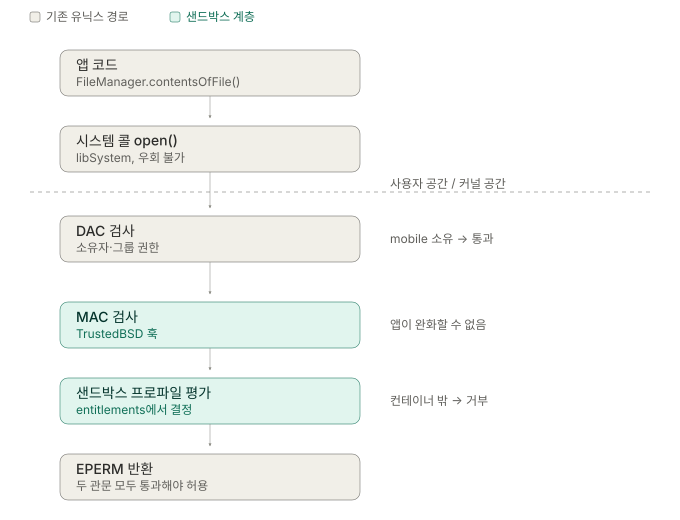
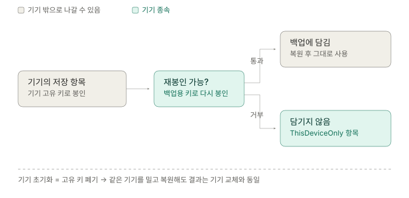

# iOS 샌드박스와 데이터 저장

앱이 저장한 파일은 정확히 무엇으로부터, 어느 계층에서 보호되고 있는가?

| 단계 | 내용 | 상태 |
|---|---|---|
| 1 | 샌드박스가 막는 것 — DAC / MAC | ✅ |
| 2 | 번들과 데이터가 갈린 이유 — 코드서명 | ✅ |
| 3 | 컨테이너 분류 — 삭제 / 백업 두 축 | ✅ |
| 4 | Data Protection — 잠금 상태와 키 | ✅ |
| 5 | Keychain — 파일과 다른 저장소 | ✅ |
| 6 | 백업과 복원 | ✅ |

메모리 구조(프로세스 주소 공간, clean/dirty, Jetsam)는 다루는 계층이 달라 별도 노트로 분리했다.

---

## 1. 샌드박스는 무엇을 막는가

> 유닉스 권한 모델로는 풀 수 없는 문제가 있어서 커널에 층을 하나 더 뒀다.

유닉스의 전통 권한 모델은 **사용자 단위**다. 프로세스는 자기를 실행한 사용자의 권한을 그대로 물려받는다.

iOS에서는 이게 문제가 된다. 모든 서드파티 앱이 `mobile`이라는 **같은 사용자**로 실행되기 때문에, 유닉스 권한만으로는 앱 A와 앱 B를 구분할 근거가 없다. 다른 앱의 토큰을 아무 앱이나 읽을 수 있다는 뜻이 된다.

### DAC와 MAC

| 구분 | 정식 명칭 | 정책 결정권 | 앱이 완화 가능한가 |
|---|---|---|---|
| DAC | Discretionary Access Control | 파일 소유자 | 가능 (`chmod`) |
| MAC | Mandatory Access Control | 시스템 | 불가능 |

샌드박스는 MAC이다. 둘의 관계는 **AND** — 어느 한쪽만 막아도 거부된다.



`FileManager`가 막는 게 아니라 커널이 막는다. TrustedBSD MAC 프레임워크가 시스템 콜 경로에 훅을 걸어두고, 그 위에 올라간 `Sandbox.kext`가 프로파일을 평가한다.

그래서 우회가 불가능하다. Foundation을 건너뛰고 C로 `open()`을 직접 불러도 같은 지점에서 걸린다. **막는 코드가 앱 프로세스 안에 없기 때문이다.**

### 프로파일은 entitlements에서 온다

앱에 붙는 샌드박스 프로파일은 entitlements(앱 서명에 포함되는 권한 명세)에서 결정된다. entitlements는 코드서명의 일부라서 **바꾸면 서명이 깨진다.** 앱이 런타임에 자기 권한을 넓히는 것이 원천적으로 불가능한 이유가 이것이다.

App Group도 같은 원리다. 앱과 익스텐션의 entitlements에 같은 group ID가 들어 있으면 커널이 그 둘에게 같은 공유 컨테이너를 허용한다. 앱끼리 직접 뚫는 게 아니라, **서명으로 증명된 관계를 커널이 인정해주는 방식**이다.

### 정리

- iOS 앱은 모두 `mobile` 사용자로 실행되므로 DAC만으로는 앱 간 격리가 불가능하다.
- 샌드박스는 MAC이며 DAC와 AND로 걸린다.
- 판정은 커널의 TrustedBSD 훅에서 일어나므로 앱 코드로 우회할 수 없다.
- 프로파일은 서명에 박힌 entitlements에서 나오므로 런타임 변경이 불가능하다.

---

## 2. 번들과 데이터가 갈린 이유

> 번들은 "만들어진 그대로"임이 증명되어야 하는 물건이라, 쓰기가 발생하면 안 된다.

실기기에서 두 경로를 찍어보면 이렇게 나온다.

```
BUNDLE : /private/var/containers/Bundle/Application/76CF32AF-.../Incheon.app
HOME   : /var/mobile/Containers/Data/Application/92BDCB56-...
```

UUID가 다르고 최상위 디렉토리도 다르다. 같은 앱인데 파일시스템 상에서는 접점이 없는 두 트리다.

확인용 코드:

```swift
print("BUNDLE :", Bundle.main.bundleURL.path)
print("HOME   :", NSHomeDirectory())
```

### 코드서명이 검증하는 것

번들 안에는 `_CodeSignature/CodeResources`가 있고, 여기에 **번들 내 모든 파일의 해시 목록**이 들어 있다. 이 목록 자체를 인증서로 서명하므로 목록도 위조할 수 없다.

| 상황 | 결과 |
|---|---|
| 번들 내 파일 내용 변경 | 해시 불일치 → 검증 실패 |
| 번들 내 파일 추가 | 목록에 없는 파일 → 검증 실패 |

즉 순서가 이렇다.

> 번들에 쓰기가 일어나면 앱이 망가진다 → 그래서 OS가 쓰기를 원천 차단했다

"읽기 전용이라서 못 쓰는 것"이 아니라 **"쓰면 안 되는 물건이라서 읽기 전용으로 만든 것"**이다. 규칙이 아니라 결과다.

### 왜 최상위에서 갈랐나

한 트리였다면(iOS 7까지) 프로파일이 "허용해놓고 그 안에 구멍을 다시 막는" 모양이 된다. 예외 조건이 하나만 잘못돼도 쓰기가 뚫린다.

최상위에서 갈라놓으면 규칙이 겹치지 않아 **경로 prefix만으로 판정이 끝난다.**

업데이트 동작에서도 이 구조가 드러난다. 번들 컨테이너는 새 UUID로 통째로 교체되고, 데이터 컨테이너는 그대로 유지된다. 리뉴얼 때 Bundle ID를 승계해 기존 앱 업데이트로 배포한 것이 통한 이유도 여기 있다 — 프로젝트를 새로 만들어 바이너리가 완전히 달라져도, 시스템 입장에서는 "같은 Bundle ID 앱의 새 번들"이라 데이터 컨테이너를 물려받는다.

### 정리

- 번들과 데이터 컨테이너는 최상위부터 분리된 별개 트리다.
- 번들이 읽기 전용인 것은 코드서명 검증의 결과이지 임의 규칙이 아니다.
- 분리 덕분에 프로파일에 예외 규칙이 필요 없고, 업데이트 시 번들만 교체된다.

---

## 3. 컨테이너 안을 나누는 기준

> 폴더 위치 자체가 앱이 OS에게 하는 약속이다.

컨테이너가 한 덩어리였다면 OS가 답할 수 없는 질문이 생긴다. **저장공간이 부족할 때 뭘 지울 수 있나**, **백업에 뭘 담아야 하나**. 둘 다 "이 파일이 다시 만들어질 수 있는가"를 알아야 답할 수 있고, 그건 앱만 안다.

표시 방법은 두 가지가 있었다.

| 방법 | 문제 |
|---|---|
| 파일마다 메타데이터 플래그 | 안 붙이면 기본값 → 절반은 틀림 |
| 폴더 위치로 선언 | 저장하려면 경로를 정해야 하므로 **선택을 피할 수 없음** |

Apple은 후자를 택했다.

### 두 축과 폴더

| 위치 | 백업 | OS 삭제 | 앱이 하는 약속 |
|---|---|---|---|
| `Documents/` | ✅ | ❌ | 사용자 것. 잃으면 안 됨 |
| `Library/Application Support/` | ✅ | ❌ | 앱 것. 동작에 필요 |
| `Library/Preferences/` | ✅ | ❌ | UserDefaults 전용 |
| `Library/Caches/` | ❌ | ✅ | 재생성 가능 |
| `tmp/` | ❌ | ✅ | 쓰고 버림 |

조합은 4가지인데 3가지만 존재한다. **"백업은 하되 OS가 지워도 됨"은 앱이 할 수 없는 약속**이기 때문이다.

### Documents와 Application Support

둘 다 백업되고 안 지워진다. 갈리는 기준은 **사용자에게 보여줄 수 있는가**다. `Info.plist`에 `UIFileSharingEnabled`를 켜면 `Documents`만 파일 앱에 노출된다.

- 사용자가 "내가 만든 것"으로 인식 → `Documents` (예: 저장한 영수증)
- 앱이 내부적으로 관리 → `Application Support` (예: 로컬 DB, 설정값)

> [!WARNING]
> `Application Support`는 기본으로 만들어져 있지 않다. `FileManager.urls(for:.applicationSupportDirectory,…)`는 경로를 계산해 돌려줄 뿐이므로, `createDirectory(withIntermediateDirectories: true)`를 먼저 하지 않으면 쓰기가 실패한다.

### Caches와 tmp

삭제 시점이 다르다. `Caches`는 저장공간 압박 시, `tmp`는 그보다 공격적으로 지워진다.

공통점이 더 중요하다. **둘 다 앱 실행 중에는 지워지지 않는다.** 다운로드 도중 파일이 증발하는 일은 없다. 대신 재실행 후 존재를 가정하면 안 된다.

```swift
// 어제 저장했으니 오늘도 있겠지 → 아니다
let data = try! Data(contentsOf: cacheURL)
```

### 세 번째 조합 만들기

"다시 받을 수는 있지만 없으면 곤란한 것"이 애매한 케이스다. 동적 스플래시의 로고 이미지가 여기 해당한다 — `Caches`에 두면 지워질 수 있고, `Documents`에 두면 백업 낭비다.

`Application Support`에 두고 백업만 제외하면 된다.

```swift
var url = appSupportURL.appendingPathComponent("splash_logo.png")
var values = URLResourceValues()
values.isExcludedFromBackup = true
try url.setResourceValues(&values)
```

폴더 위치만으로는 표현할 수 없는 조합이라, 플래그를 최소한으로 남겨둔 예외다.

### 정리

- 폴더 위치는 "지워도 되나 / 백업해야 하나"에 대한 앱의 선언이다.
- Documents와 Application Support는 사용자 노출 여부로 갈린다.
- Application Support는 직접 생성해야 한다.
- Caches·tmp는 실행 중에는 안 지워지지만, 재실행 후 존재를 가정하면 안 된다.
- `isExcludedFromBackup`으로 "안 지워지되 백업 제외" 조합을 만든다.

---

## 4. Data Protection

> 샌드박스는 살아있는 시스템만 통제한다. 꺼진 기기의 저장매체는 다른 문제다.

샌드박스는 실행 중인 프로세스를 커널이 검사해 막는 장치다. 공격자가 iOS를 부팅하지 않고 저장 칩을 직접 읽으면 검사할 주체가 없다.

그래서 파일시스템을 암호화하는데, 여기서 진짜 질문이 나온다. **키를 어디에 두나?** 기기에 그냥 두면 칩을 뜯은 공격자가 파일과 키를 함께 가져간다.

해법은 **사용자 패스코드를 키 유도에 섞는 것**이다. 패스코드는 기기에 저장되지 않는다.

### 그래서 생긴 모순

패스코드를 섞으면 기기가 잠긴 동안에는 키가 없다. 그런데 iOS는 잠긴 상태에서도 푸시 수신, 백그라운드 다운로드, 알람을 처리해야 한다.

**강하게 보호하면 잠긴 동안 못 쓰고, 쓸 수 있게 하면 보호가 약해진다.** 그래서 파일마다 보호 강도를 고르게 했다.

| 클래스 | 읽을 수 있는 시점 | 키가 지워지는 시점 |
|---|---|---|
| Complete | 잠금 해제 상태에서만 | 잠기는 즉시 |
| CompleteUnlessOpen | 잠기기 전에 연 파일은 계속 | 파일을 닫으면 |
| CompleteUntilFirstUserAuthentication | 부팅 후 한 번 풀었으면 계속 | 재부팅 시 |
| None | 항상 | 지워지지 않음 |

### 기본값이 세 번째인 이유

`Complete`가 기본이면 백그라운드 작업이 전부 깨지고, `None`이 기본이면 아무도 신경 쓰지 않는다. 세 번째는 절충이다 — 분실 기기를 주운 공격자는 보통 재부팅부터 하므로 실제 방어가 되고, 백그라운드 작업은 정상 동작한다.

### BFU / AFU와 Face ID

Apple은 재부팅 후 첫 잠금해제 이전을 **BFU**(Before First Unlock), 이후를 **AFU**라고 부른다. 세 번째 클래스 이름의 "FirstUserAuthentication"이 그 경계다.

재부팅 직후 Face ID가 거부되고 패스코드를 요구하는 이유가 여기서 나온다. 인과 방향이 중요하다.

> Face ID가 안 되니까 패스코드를 받는 게 아니라, **패스코드를 받아야만 하니까 Face ID를 안 쓴다.**

**Face ID는 키를 만들 수 없다.** 생체인증이 하는 일은 "등록된 사용자가 맞다"는 판정이고, 거기서 암호 키가 나오지 않는다. 키를 만들려면 패스코드라는 비밀값 자체가 필요하다.

한 번 패스코드로 풀고 나면 유도된 키가 Secure Enclave에 살아있으므로, 이후 잠금은 키를 지우는 게 아니라 봉인하는 것이다. Face ID는 "키를 만들어라"가 아니라 **"봉인을 풀어라"**는 신호로 동작한다.

패스코드를 다시 요구하는 조건은 성격이 나뉜다.

| 구분 | 조건 |
|---|---|
| 키가 없음 | 재부팅 직후 |
| 정책상 재확인 | 48시간 미사용, Face ID 5회 실패, 측면 버튼 5회 연타, 생체/패스코드 설정 변경 |

두 번째 그룹은 키 문제가 아니라 "생체만으로 계속 신뢰하지 않겠다"는 정책이다. 생체는 **거부할 수 없다**는 약점이 있다 — 강압 상황에서 얼굴은 향하게 만들 수 있지만 패스코드는 본인이 입력해야 한다.

### 실무에서 갈리는 지점 — 신분증 이미지

촬영한 신분증 이미지는 개인정보라 기본값으로는 부족하다.

```swift
try data.write(to: url, options: [.completeFileProtection])
```

그런데 `Complete`로 두면 **백그라운드 업로드 중 사용자가 기기를 잠그면 읽기가 실패한다.** 선택지는 셋이다.

| 방식 | 대가 |
|---|---|
| `Complete` + 포그라운드 업로드만 | UX 제약 |
| `CompleteUnlessOpen` + 잠기기 전 핸들 확보 | 업로드 유지 가능 |
| 파일로 떨어뜨리지 않고 메모리에서 전송 | 문제 자체를 제거 |

가능하면 세 번째가 가장 깔끔하다. SDK가 `Data`나 `UIImage`로 결과를 준다면 디스크에 쓸 이유가 없다.

> [!CAUTION]
> SDK가 내부적으로 임시 파일을 만들면 그 파일의 보호 클래스를 지정할 수 없고 기본값으로 떨어진다. 3계층으로 SDK 의존성을 격리해도 SDK가 디스크에 쓰는 것까지 막히지는 않는다. Xcode의 Download Container로 받아 실제로 무엇을 남기는지 확인하는 편이 확실하다.

### 정리

- 파일 키는 패스코드에서 유도되므로 잠긴 동안 접근이 제한된다.
- 백그라운드 작업과의 충돌 때문에 보호 강도를 클래스로 나눴다.
- 기본값은 재부팅 방어와 백그라운드 동작을 절충한 지점이다.
- Face ID는 키를 만들지 못하므로 BFU에서는 패스코드가 필수다.
- 강한 클래스는 백그라운드 접근을 포기하는 대가를 치른다.

---

## 5. Keychain

> 파일로는 해결되지 않는 세 가지가 있어서 별도 저장소로 뺐다.

| 파일의 한계 | Keychain의 해결 |
|---|---|
| 쓸 때마다 옵션을 챙겨야 함 → 누락 가능 | 저장 시 접근성 클래스 지정이 필수 |
| 앱 자신은 언제든 읽음 | 항목에 인증 조건을 붙일 수 있음 |
| 백업/복원으로 기기를 넘어감 | 기기 종속 여부를 항목 단위로 선언 |

핵심 차이는 이것이다. **파일은 "어디에 두느냐"로 성격이 정해지지만, Keychain은 "어떤 조건으로 저장하느냐"로 정해진다.** 조건이 항목에 박혀 있어 읽을 때 우회할 수 없다.

Keychain은 컨테이너 안이 아니라 시스템이 관리하는 별도 DB에 있다. 카드번호처럼 민감한 값을 `UserDefaults` 대신 Keychain에 넣는 것이 이 지점에서 값을 한다 — `UserDefaults`는 `Library/Preferences`의 **평문 plist**이고 백업에도 그대로 들어간다.

### 두 개의 다른 축

이름이 비슷해 섞이기 쉬운데 별개다.

| 축 | 무엇을 정하나 | API |
|---|---|---|
| 접근성 (Accessibility) | 언제 읽을 수 있나 | `kSecAttrAccessible...` |
| 접근 제어 (Access Control) | 누가 확인해야 읽을 수 있나 | `SecAccessControl` |

둘은 AND로 걸린다. 잠금이 풀려 있어도 생체 확인을 안 하면 읽을 수 없다.

| 접근성 클래스 | 읽을 수 있는 시점 |
|---|---|
| `WhenUnlocked` | 잠금 해제 상태에서만 |
| `AfterFirstUnlock` | 부팅 후 한 번 풀면 이후 계속 |
| `WhenPasscodeSetThisDeviceOnly` | 패스코드 설정된 기기에서만, 백업 제외 |

실무에서 실제로 나오는 상황 — **재부팅 직후 푸시를 받아 백그라운드로 토큰을 갱신해야 하는데, 토큰이 `WhenUnlocked`면 읽기가 실패한다.** 재현이 어려워 놓치기 쉽다.

기준은 이렇다. 백그라운드에서 필요한 자격증명은 `AfterFirstUnlock`, 사용자 앞에서만 쓰는 값은 `WhenUnlocked`.

### ThisDeviceOnly

차이는 **키를 감싸는 마스터키가 백업에 포함되는가**다.

| 구분 | 동작 |
|---|---|
| 일반 | 키가 백업에 포함 → 새 기기에서도 살아남음 |
| `ThisDeviceOnly` | 키가 기기 고유 키에 묶임 → 백업에 실리지 않음 |

판단 기준은 "복원 후에도 살아있어야 하나"다.

- 로그인 리프레시 토큰 → 기기를 바꿔도 유지되면 좋음 → 일반
- 기기 바인딩된 등록 정보·결제 자격증명 → 새 기기면 재등록이 정상 → `ThisDeviceOnly`

금융앱은 후자가 많다. 기기 바인딩이 보안 요건인 경우 복원으로 자격증명이 딸려가면 오히려 취약점이다.

`WhenPasscodeSetThisDeviceOnly`는 한 단계 더 나아가, 사용자가 패스코드를 끄면 항목이 삭제된다. 패스코드 없는 기기는 키 유도 재료가 없어 Data Protection 자체가 무의미하기 때문이다.

### 생체를 거는 것

```swift
let access = SecAccessControlCreateWithFlags(
    nil,
    kSecAttrAccessibleWhenPasscodeSetThisDeviceOnly,
    .biometryCurrentSet,
    nil
)
```

| 플래그 | 동작 |
|---|---|
| `.biometryAny` | 등록된 생체면 통과. 이후 추가돼도 유효 |
| `.biometryCurrentSet` | 현재 등록 집합에 묶임. 생체가 변경되면 항목 무효화 |
| `.userPresence` | 생체 실패 시 패스코드로 대체 가능 |

`.biometryCurrentSet`은 공격자가 자기 생체를 추가하는 경로를 차단한다. 대가는 **사용자가 Face ID를 재등록하면 저장값이 날아간다**는 것이고, 이는 "왜 갑자기 로그아웃됐지" VOC가 된다. 인증 구간 담당이면 그대로 걸리는 트레이드오프다.

`.userPresence`는 편하지만 보호 강도가 패스코드 수준으로 내려간다.

> [!IMPORTANT]
> `SecAccessControl`이 걸린 항목은 읽을 때 인증 UI가 뜨고 그동안 블로킹된다. 메인 스레드에서 `SecItemCopyMatching`을 호출하면 UI가 멈춘다. 백그라운드 큐에서 호출해야 한다.

### 앱 삭제 후 잔존

Keychain 항목은 컨테이너가 아니라 시스템 DB에 있으므로 앱을 지워도 남는다. 증상은 **재설치했는데 이전 사용자로 로그인돼 있음**이다.

`UserDefaults`는 컨테이너 안이라 함께 지워진다. 이 비대칭 자체를 신호로 쓸 수 있다.

```swift
if !UserDefaults.standard.bool(forKey: "hasLaunchedBefore") {
    deleteAllKeychainItems()
    UserDefaults.standard.set(true, forKey: "hasLaunchedBefore")
}
```

### 정리

- Keychain은 조건을 항목에 박아 실수와 우회를 구조적으로 막는다.
- 접근성과 접근 제어는 별개 축이고 AND로 걸린다.
- 백그라운드에서 필요한 값은 `AfterFirstUnlock`이어야 한다.
- `ThisDeviceOnly`는 기기 이전을 차단하며, 금융앱 기기 바인딩과 맞는다.
- `.biometryCurrentSet`은 안전하지만 생체 재등록 시 값이 소실된다.
- 앱 삭제 시 잔존하므로 첫 실행 감지로 정리해야 한다.

---

## 6. 백업과 복원

> 앞의 세 축이 백업 시나리오에서 한 번에 맞물린다.

### 무엇이 담기나

| 대상 | 백업 |
|---|---|
| `Documents/`, `Library/Application Support/`, `Library/Preferences/` | 담김 |
| `Library/Caches/`, `tmp/` | 안 담김 |
| 번들 (`.app`) | 안 담김 — 복원 시 App Store에서 재다운로드 |

번들이 빠지는 것은 용량 문제만이 아니다. 바이너리는 그 기기·계정에 맞게 서명되어 있어 통째로 옮기는 것이 의미가 없다. Download Container로 번들을 받을 수 없는 것과 같은 이유다.

### 어떻게 담기나

iCloud 백업은 기기에서 암호화한 상태로 전송·저장된다. 그런데 기기의 파일 키는 패스코드에서 유도되어 Secure Enclave 안에 있으므로 그대로 올릴 수 없다.

그래서 백업 시 **키를 다시 감싼다.** 기기 종속 키에서 풀어 백업용 키로 재봉인하고, 이 과정을 통과할 수 있는 항목만 실린다.



`ThisDeviceOnly`가 넘어가지 않는 이유가 여기서 설명된다. "백업에서 제외하자"가 아니라 **애초에 기기 밖으로 나갈 수 있는 형태로 만들 수 없다**가 정확한 표현이다.

### 복원 결과

| 항목 | 새 기기에서 |
|---|---|
| `Documents`, `Application Support` | 복원됨 |
| `Caches`, `tmp` | 없음 |
| `UserDefaults` | 복원됨 (평문 plist) |
| Keychain 일반 | 복원됨 |
| Keychain `ThisDeviceOnly` | **사라짐** |
| 앱 바이너리 | 재다운로드 |

### 같은 기기를 밀고 복원한 경우

결과가 새 기기와 **완전히 동일하다.**

기기를 지우면 Secure Enclave의 기기 고유 키가 폐기된다. `ThisDeviceOnly`의 "Device"는 물리적 기기가 아니라 **그 기기의 현재 키 상태**이므로, 하드웨어가 그대로여도 시스템 입장에서는 다른 기기와 구분되지 않는다.

이것이 실무에서 중요한 이유는, 기기 교체는 드물어도 **초기화 후 복원은 사용자가 문제 해결 삼아 흔히 하는 행동**이기 때문이다. 예외 케이스가 아니라 정상 처리해야 할 경로다.

동시에 테스트 부담을 줄여준다. 새 기기 없이 쓰던 기기 한 대를 밀었다 복원하면 기기 교체 시나리오가 그대로 재현된다.

### 백업이 실행되는 순간

앱에는 아무 일도 일어나지 않는다. 알림도 훅도 없고 완전히 투명하다.

### 진입 구간에서 확인할 것

- 자동 로그인 토큰이 사라진 상태에서 정상적으로 로그인 화면까지 가는가
- 간소화 모드 진입 판단 값이 Keychain에 있다면, 없을 때 어떻게 되는가
- `Caches`가 빈 상태에서 스플래시가 정상 진행되는가

세 번째는 특히 볼 만하다. `Application Support` + 백업 제외로 두어도 복원 후에는 비어 있다. 즉 **"동적 스플래시 로고가 없는 상태"는 반드시 통과 가능해야 하는 경로**다.

### 정리

- 백업 대상은 폴더 위치로, 암호화 항목의 이전 가능 여부는 키 재봉인으로 결정된다.
- `ThisDeviceOnly`는 제외되는 게 아니라 이전 가능한 형태로 만들 수 없다.
- 기기 초기화는 키 폐기이므로 같은 기기라도 복원 결과는 기기 교체와 같다.
- 복원 직후 상태(캐시 없음 + 일부 자격증명 없음 + BFU)는 정상 처리해야 할 경로다.

---

## 미확인 사항

- 실행 중 번들 리소스 파일이 어느 시점에 재검증되는지. 실행 바이너리의 코드 페이지 검증은 확실하나 리소스는 확인 못 함. 쓰기가 원천 차단이라 실무 판단은 갈리지 않음.
- `tmp` 삭제의 구체적 트리거. 공식 설명은 "앱이 실행 중이 아닐 때 주기적으로"까지.
- `Complete` 클래스 키가 잠금 후 지워지기까지 유예가 있는지, iOS 버전별 차이.
- 앱 삭제 시 Keychain 잔존 동작. iOS 10.3 베타에서 함께 삭제로 바뀌었다가 정식에서 되돌려졌음. 현재도 "남는다"가 맞으나 최신 버전 예외 케이스는 미확인 — 실기기 검증 필요.
- 잠금 상태에서 백업이 돌 때 `Complete` 클래스 파일이 건너뛰어지는지 다음 기회를 기다리는지.
- Advanced Data Protection(종단간 암호화 백업)을 켠 경우 앱 입장에서 복원 결과가 달라지는지.
