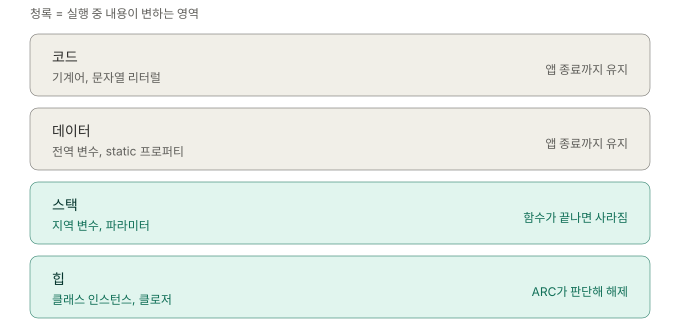
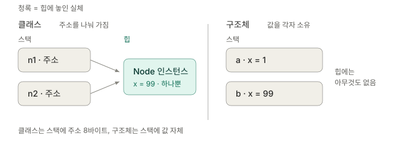
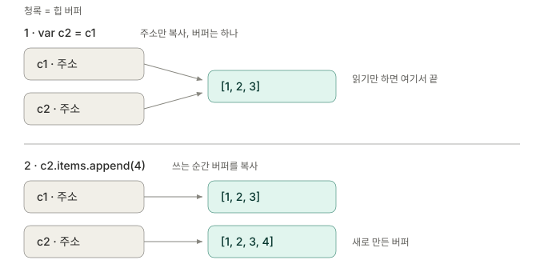
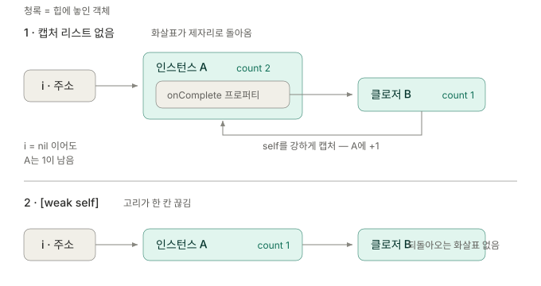
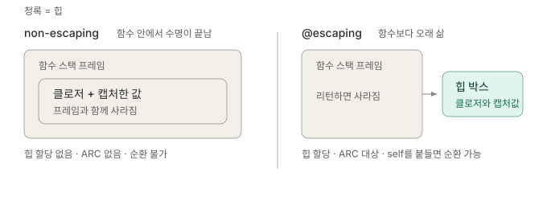

# 스위프트 메모리 구조와 ARC

내가 만든 값은 어디에 놓이고, 누가 언제 없애는가.

| 단계 | 내용 | 상태 |
|---|---|---|
| 1 | 네 영역 · 스택과 힙 | ✅ |
| 2 | 값 타입 / 참조 타입의 저장 위치 | ✅ |
| 3 | CoW · struct 안의 class | ✅ |
| 4 | ARC와 순환 참조 | ✅ |
| 5 | 클로저 캡처 · escaping | ✅ |
| 6 | 메모리 이슈 진단 (Memory Graph, Leaks) | ⚪️ |
| 7 | jetsam · dirty/clean 페이지 | ⚪️ |

---

## 네 영역

> 앞의 둘은 컴파일 시점에 확정되고, 뒤의 둘만 실행 중에 변한다.



코드와 데이터는 크기와 위치가 빌드 시점에 정해져서 실행 중 신경 쓸 일이 거의 없다. 실무에서 판단이 갈리는 건 **스택과 힙 사이**뿐이다.

### 정리

- 코드·데이터는 앱 종료까지 그대로, 실행 중 관심 대상이 아니다.
- 실행 중 변하는 건 스택과 힙 둘뿐이다.

---

## 스택 — 함수와 생사를 같이 한다

> 함수가 끝나면 사라지므로, 함수보다 오래 살아야 하는 값은 담을 수 없다.

함수를 호출하면 스택 프레임이 한 칸 쌓이고, 지역 변수와 파라미터가 거기 들어간다. return하면 그 칸이 통째로 사라진다. 정리를 "해주는" 게 아니라 스택 포인터를 되돌리기만 하면 끝이라 거의 공짜다.

```swift
func calculate() {
    let count = 10        // 스택
    let rate = 0.5        // 스택
}                         // 여기서 둘 다 사라짐
```

스택은 스레드마다 하나씩이고, 스레드 생성 시점에 크기가 고정된다. 메인 스레드 1MB, 그 외 스레드 기본 512KB. 재귀가 깊어지면 이 벽에 부딪힌다.

> [!NOTE]
> "스택은 인스턴스들이 공유하는 공간"은 틀린 문장이다. 스택은 공유되는 게 아니라 정반대로 **스레드마다 따로 갖는 개인 공간**이다. 공유되는 건 힙에 놓인 인스턴스다.

### 정리

- 스택은 함수 프레임 단위로 쌓였다 사라지고, 해제 비용이 사실상 없다.
- 스레드마다 별개이며 크기가 고정이다.
- 함수보다 오래 살아야 하는 값은 스택에 둘 수 없다 — 이것이 힙이 필요한 이유 전부다.

---

## 힙 — 오래 살아야 하는 것들

> 실체는 힙에 하나, 그것을 가리키는 주소는 스택에 여럿.

```swift
func setup() {
    let vm = ViewModel()   // 인스턴스는 힙에, vm(주소)은 스택에
    self.viewModel = vm
}                          // vm 변수는 사라지지만 인스턴스는 살아있음
```

함수가 끝나면 `vm`은 사라지지만 `self.viewModel`이 같은 주소를 들고 있으니 인스턴스는 살아남는다. **주소를 여러 곳에서 나눠 가질 수 있다는 것**, 이것이 "공유"다.

문제는 힙에는 "함수 끝"처럼 명확한 해제 시점이 없다는 점이다. 그래서 누군가 세어야 한다 — 그게 ARC다.

### 정리

- 클래스 인스턴스와 클로저가 사는 곳이 힙이다.
- 스택 변수는 실체가 아니라 힙 주소를 담고 있을 뿐이다.
- 해제 시점이 자명하지 않아 참조 카운팅이 필요하다.

---

## 값 타입과 참조 타입

> 구분의 실체는 "스택에 값이 놓이느냐, 주소가 놓이느냐"다.



```swift
struct Point { var x: Int }
class  Node  { var x: Int = 0 }

var a = Point(x: 1)
var b = a        // 값이 복사됨. 스택에 두 덩어리, 힙에는 아무것도 없음
b.x = 99         // a.x는 그대로 1

var n1 = Node()
var n2 = n1      // 주소가 복사됨. 힙에 인스턴스는 하나
n2.x = 99        // n1.x도 99
```

| | 스택에 있는 것 | 크기 | 공유 | ARC |
|---|---|---|---|---|
| 클래스 | 주소 8바이트 | 항상 8 | 됨 | 있음 |
| 구조체 | 값 자체 | 프로퍼티 합만큼 | 안 됨 | 없음 |

클래스가 굳이 주소를 거치는 이유는 두 가지다. 상속 때문에 실제로 어떤 타입이 들어올지 몰라 **크기를 컴파일 시점에 확정할 수 없고**, 여럿이 같은 실체를 공유해야 하기 때문이다. 주소는 무엇이 오든 8바이트라 스택 칸에 담긴다.

구조체는 컨테이너가 아니라 **레이아웃**이다. `struct Point { var x: Int; var y: Int }`는 연속된 16바이트 하나이고 x가 앞 8, y가 뒤 8이다. 다음 절에서 이 성질이 문제를 만든다.

### 정리

- 구조체는 스택에 값 자체, 클래스는 스택에 주소가 놓인다.
- 클래스가 힙을 쓰는 건 상속으로 크기가 미정이고 공유가 필요하기 때문이다.
- 구조체에는 셀 참조가 없으므로 ARC도 없다.

---

## struct라고 항상 스택은 아니다

> 저장 위치를 정하는 건 struct/class가 아니라 "크기가 고정인가"와 "안에 뭐가 들었나"다.

### Array와 String — 크기가 변하니 힙

```swift
struct Container { var items: [Int] }

var c1 = Container(items: [1, 2, 3])
var c2 = c1              // 주소 8바이트만 복사
c2.items.append(4)       // c1.items는 여전히 [1,2,3]
```

`Array`는 struct지만 원소를 자기 안에 담지 않는다. 원소는 힙 버퍼에 있고 Array 값은 그 **버퍼 주소 하나**를 들고 있다. 원소가 3개든 300만 개든 크기는 8바이트 고정이다.

이유는 순서가 반대다. 배열은 실행 중 크기가 변하는데 스택 프레임은 진입 시점에 크기가 확정돼야 한다. **크기가 변하는 것은 힙에 둘 수밖에 없다**는 제약이 먼저고, 값 타입처럼 보이게 만든 건 그 위에 얹은 것이다.

### CoW — 복사를 쓰기 시점까지 미룬다



쓰기가 일어나는 순간 이 버퍼를 나 말고 또 누가 보고 있는지 확인하고, 참조가 2 이상이면 그 자리에서 버퍼를 통째로 복사한 뒤 자기 복사본에만 쓴다.

그래서 큰 배열을 함수에 넘기는 건 비싸지 않다. 다만 **값 타입이라고 복사가 공짜인 것도 아니다.** 배열을 여러 곳에서 들고 있는 상태로 쓰기를 반복하면 매번 전체 복사가 터진다. 참조가 하나면 제자리 수정이라 공짜다.

### struct 안에 class를 넣으면 값 타입이 아니게 된다

```swift
class Config { var timeout = 30 }

struct Settings {
    var name: String
    var config: Config      // 클래스
}

var s1 = Settings(name: "A", config: Config())
var s2 = s1
s2.config.timeout = 60      // s1.config.timeout도 60
```

`Settings`는 복사되지만, 복사되는 내용물이 `config`의 **주소**다. "구조체는 레이아웃일 뿐"이 여기서 걸린다 — 담긴 게 주소면 복사해봐야 같은 곳을 가리키는 주소 두 개다. 게다가 struct를 복사하기만 해도 `config`에 대한 retain이 하나 늘어난다.

> [!WARNING]
> 값 타입 모델을 만들었는데 예상치 못한 공유가 생긴다면 대개 이 형태다. struct 안에 참조 타입 프로퍼티가 몇 개 섞여 있는지가 판단 지점이다.

### 정리

- Array/String은 struct지만 버퍼는 힙에 있고, 값은 주소 8바이트다.
- CoW는 쓰기 시점에 참조가 2 이상일 때만 실제 복사를 한다.
- struct 안의 class 프로퍼티는 복사되지 않고 공유된다.

---

## ARC

> 자동인 것은 코드를 짜주는 일이지, 실행 중 판단이 아니다.

retain count는 힙 인스턴스의 헤더에 들어 있다. 중앙 테이블이 따로 있는 게 아니다.

```
힙
┌─────────────────────┐
│ isa (타입 정보)      │  ← 헤더
│ refCount            │  ← 여기
├─────────────────────┤
│ x = 99              │  ← 내 프로퍼티
└─────────────────────┘
```

그래서 `class Node { var x: Int }`의 실제 크기는 헤더 16바이트 + 8이다. 인스턴스마다 붙는 고정 비용이 있고, 작은 객체를 수만 개 만들 때 struct가 유리한 이유 중 하나다.

### GC가 아니라 컴파일러가 삽입한다

컴파일 시점에 컴파일러가 retain/release 호출을 코드 사이에 박아 넣는다. 별도 스레드가 도는 GC와 달리 실행 중 추가 비용은 카운터 증감뿐이고, **0이 되는 순간 즉시 해제**된다.

| | GC | ARC |
|---|---|---|
| 판정 기준 | 루트에서 도달 가능한가 | 카운트가 0인가 |
| 순환 참조 | 알아서 수거됨 | 개발자가 끊어야 함 |
| 해제 시점 | 예측 불가 | 0이 되는 즉시 |

**순환 참조는 ARC의 버그가 아니라 설계상 지불한 대가다.** 즉시 해제와 예측 가능한 성능을 얻는 대신 순환은 개발자 몫으로 넘겼다. `deinit`에 리소스 정리를 넣을 수 있는 것이 그 대가로 받은 쪽이다.

### 실무에서 걸리는 지점

컴파일러 최적화가 불필요한 retain/release 쌍을 지운다. 그래서 **디버그와 릴리즈에서 `deinit` 타이밍이 달라질 수 있다** — deinit 시점에 의존하는 코드를 짜면 안 된다.

카운터는 여러 스레드에서 동시에 증감될 수 있어 원자적 연산을 쓴다. 일반 정수 증감보다 비싸고, 뜨거운 루프에서 클래스와 구조체의 성능 차이가 벌어지는 이유다. 다만 대부분의 앱 코드에서는 측정 가능한 수준이 아니다.

검증은 `CFGetRetainCount()`로 숫자를 보는 것보다 **"deinit이 불리는가"만 확인**하는 쪽이 실용적이다. 최적화 때문에 숫자가 직관과 안 맞는 경우가 많다.

### 정리

- retain count는 인스턴스 헤더에 있고, 클래스는 그만큼 고정 오버헤드가 있다.
- ARC는 컴파일 타임에 삽입되며 0이 되는 즉시 해제한다.
- 순환 참조는 즉시 해제를 얻은 대가다.
- deinit 시점은 빌드 설정에 따라 달라질 수 있으니 의존하지 않는다.

---

## 순환 참조

> 카운트가 몇이냐가 아니라, 화살표를 따라가면 제자리로 돌아오느냐가 기준이다.

```swift
class Parent { var child: Child? }
class Child  { var parent: Parent? }

var p: Parent? = Parent()   // A: 1
var c: Child?  = Child()    // B: 1

p?.child = c                // B: 2
c?.parent = p               // A: 2

p = nil                     // A: 1  ← 0이 안 됨
c = nil                     // B: 1  ← 0이 안 됨
```

카운트가 2가 되는 것 자체는 정상이다. 문제는 **남은 1을 내려줄 사람이 그래프 바깥에 없다**는 것이다.

어느 쪽을 약하게 할지는 **소유 방향**으로 정한다. 소유하는 쪽이 강, 알고만 있는 쪽이 약. 이 기준이 흔들리면 나중에 예상 못 한 시점에 nil이 뜬다.

### weak와 unowned

| | 카운트 | 해제 후 | Optional | 비용 |
|---|---|---|---|---|
| `weak` | 안 올림 | 자동으로 nil | 필수 | 있음 |
| `unowned` | 안 올림 | 접근 시 크래시 | 아님 | 거의 없음 |

`weak`가 비싼 이유는 대상이 죽을 때 자기를 nil로 바꿔야 하고, 그러려면 **누가 나를 weak로 보는지 목록**(side table)이 필요하기 때문이다. 읽을 때도 읽는 도중 죽으면 안 되니 임시로 강한 참조를 잡았다 놓는다.

> [!TIP]
> 수명 관계를 100% 확신하고 그것이 앞으로도 안 변할 때만 `unowned`, 나머지는 `weak`. 확신이 틀리면 크래시인데 얻는 성능은 대개 측정도 안 되는 수준이라 거래가 맞지 않는다.

### 정리

- 순환 판정은 카운트 숫자가 아니라 화살표가 닫히는지로 한다.
- 소유하는 쪽이 강, 참조만 하는 쪽이 약.
- `weak`는 side table 때문에 할당·해제·읽기 전부에 비용이 붙는다.

---

## 클로저 캡처와 [weak self] 판단

> 클로저가 캡처한 값은 힙 박스로 옮겨지고, 그 박스가 self에게 되돌아올 때만 순환이다.



```swift
class Interactor {
    var onComplete: (() -> Void)?

    func setup() {
        onComplete = { self.doSomething() }   // 순환
    }
}
```

self → 클로저 → self. 앞의 Parent/Child와 같은 그림인데 한쪽이 클로저일 뿐이다.

### 붙일지 말지의 기준

**그 클로저를 self가 (직접이든 간접이든) 붙들고 있는가.** 붙들고 있지 않으면 순환이 아니다.

```swift
// 순환 아님 — 실행되고 버려짐
UIView.animate(withDuration: 0.3) { self.view.alpha = 0 }
DispatchQueue.main.async { self.updateUI() }

// 순환 — self의 프로퍼티가 클로저를 들고 있음
cancellable = publisher.sink { [weak self] value in
    self?.handle(value)
}
```

`Timer`, `NotificationCenter` 옵저버, 델리게이트 프로퍼티, 저장해두는 완료 핸들러가 전부 후자에 걸린다. 리액티브 파이프라인은 대부분 이 형태라 `[weak self]`가 사실상 기본값이 된다.

### 순환이 아닌 곳에 붙이면 — 누수가 아니라 다른 선택

| | 안 붙임 | 붙임 |
|---|---|---|
| 실행 보장 | 됨 | 안 됨 (죽었으면 스킵) |
| self 수명 | 클로저 실행까지 연장 | 연장 안 함 |
| 위험 | 무거운 객체가 잠깐 더 삶 | 실행이 조용히 누락 |

UI 갱신은 화면이 사라졌으면 안 해도 되는 일이라 `[weak self]`가 실질적 손해가 없다. 문제는 부수 효과가 있는 작업이다 — 저장, 전송, 상태 갱신은 조용히 누락된다.

> [!IMPORTANT]
> 다만 이때 답은 "`[weak self]`를 빼자"가 아니다. 클로저가 self를 붙들어 억지로 살려두는 건 보장이 아니라 우연이다. **소유자가 잘못 잡혀 있다는 신호**로 읽어야 한다.

| 작업 성격 | 소유자 |
|---|---|
| 화면이 사라지면 의미 없음 (UI 갱신, 로딩 표시) | 화면 계층 + `[weak self]` |
| 화면과 무관하게 끝나야 함 (저장, 전송, 토큰 갱신) | 오래 사는 서비스 계층 |
| 앱이 죽어도 보장해야 함 | 메모리로 불가 — 영속성 설계 문제 |

후자에서는 self가 앱 수명만큼 사는 객체라 `[weak self]` 논쟁 자체가 사라진다.

### 중간에 죽는 문제

```swift
{ [weak self] in
    self?.startLoading()
    someWork()
    self?.stopLoading()      // 여기서 nil이면 로딩이 안 꺼짐
}
```

앞은 실행되고 뒤는 안 되는 반쪽 상태가 된다. `guard let self else { return }`을 맨 위에 두는 이유가 이것 — 거기서 강한 참조를 잡아 클로저가 끝날 때까지는 죽지 않도록 고정한다. **전부 실행하거나 아예 안 하거나** 둘 중 하나로 만드는 장치다.

### 정리

- 판단 기준은 하나 — self가 그 클로저를 붙들고 있는가.
- 순환이 아닌 곳의 `[weak self]`는 누수가 아니라 "실행 보장 vs 스킵" 선택이다.
- 붙일지 고민된다면 소유자가 잘못 잡혔다는 신호로 읽는다.
- 중간에 nil이 되는 반쪽 실행은 `guard let self`로 막는다.

---

## 캡처 리스트

> `[weak self]`는 특별한 키워드가 아니라, "박스에 뭘 어떻게 담을지" 지정하는 한 문법의 갈래다.

```swift
var count = 0

let a = { print(count) }              // 변수 자체를 공유
let b = { [count] in print(count) }   // 지금 값을 복사해 고정

count = 99
a()   // 99
b()   // 0
```

| 형태 | 하는 일 |
|---|---|
| 없음 | 변수를 공유. 참조 타입이면 강하게 붙듦 |
| `[x]` | 지금 값을 복사해 고정 (`let`이라 수정 불가) |
| `[weak self]` | 약하게 담음 — 카운트 안 올림 |
| `[unowned self]` | 약하게 담되 nil 처리 없음 |

Swift는 `for i in 0..<3` 같은 반복문에서 매 반복마다 `i`가 새 상수라 의도대로 동작한다. 하지만 루프 바깥의 가변 변수를 캡처하면 실행 시점 값을 보게 되므로 `[value]`로 박제해야 한다.

### 정리

- 캡처 리스트는 캡처 방식을 지정하는 문법이고 `[weak self]`는 그 한 갈래다.
- 값 캡처는 클로저 생성 시점의 스냅샷이다.

---

## escaping / non-escaping

> 기준은 키워드가 아니라 수명 — 함수 프레임보다 오래 살아야 하면 힙.



non-escaping이면 클로저 수명이 함수 안에 갇히므로 컴파일러가 힙 박스 없이 처리할 수 있다. 캡처한 값도 함수가 사는 동안만 필요하기 때문이다.

Swift 3에서 기본값이 뒤집혔다. 원래는 non-escaping을 명시하는 방식이었는데, **대부분의 클로저는 탈출하지 않고 탈출하는 쪽이 위험하니 위험한 쪽을 명시**하게 바꿨다.

### 세 가지 실무 접점

**`self.` 생략 여부** — non-escaping에서는 생략 가능, escaping에서는 강제된다. 문법이 까다로운 게 아니라 "여기서 self를 캡처하고 있다"를 눈으로 보게 하는 장치다. `self.`를 쓰라는 에러가 뜨면 그 자리가 순환 후보라는 신호다.

**순환이 원천적으로 안 생김** — non-escaping은 누가 오래 붙들 방법이 없다. `map`, `filter`, `forEach`, `UIView.animate`에 `[weak self]`가 필요 없는 이유다.

**성능** — 힙 할당과 ARC가 없어 뜨거운 루프에서 유의미하게 빠르다. `@escaping`을 습관적으로 붙이면 이 최적화가 날아간다.

### 함수와 힙은 별개의 축

```swift
func makeNode() {
    let node = Node()      // escaping과 무관하게 힙 할당
}
```

| | 스택 | 힙 |
|---|---|---|
| 함수 프레임 (지역 변수, 파라미터) | O | |
| 클래스 인스턴스, Array/String 버퍼 | | O |
| non-escaping 클로저 | O | |
| escaping 클로저 + 캡처한 값 | | O |

윗줄 둘은 **무엇을 만들었나**, 아랫줄 둘은 **얼마나 오래 사나**가 정한다. 두 질문이 따로 작동한다.

### 정리

- escaping은 판정 결과에 붙은 이름이고, 실제 기준은 수명이다.
- non-escaping은 힙 할당·ARC·순환이 전부 없다.
- "무엇을 만들었나"와 "얼마나 오래 사나"는 별개의 축이다.

---

## 미확인 사항

- `weak`의 side table이 해제 시점에 실제로 어떤 순서로 nil 처리를 하는지는 개념 수준까지만 확인했다. `unowned` 선택 기준을 바꾸지 않아 더 파지 않음.
- 컴파일러가 retain/release를 제거하는 구체적 조건(어떤 최적화 패스에서, 어떤 상황에)은 확인하지 않았다.
- `@autoclosure`는 평가를 미루는 문법으로 메모리 축과 별개라 다루지 않았다.
- non-escaping 클로저가 항상 스택에 놓이는지, 컴파일러가 그렇게 최적화할 수 있는 조건이 붙는지는 개념 수준까지만 확인했다.
