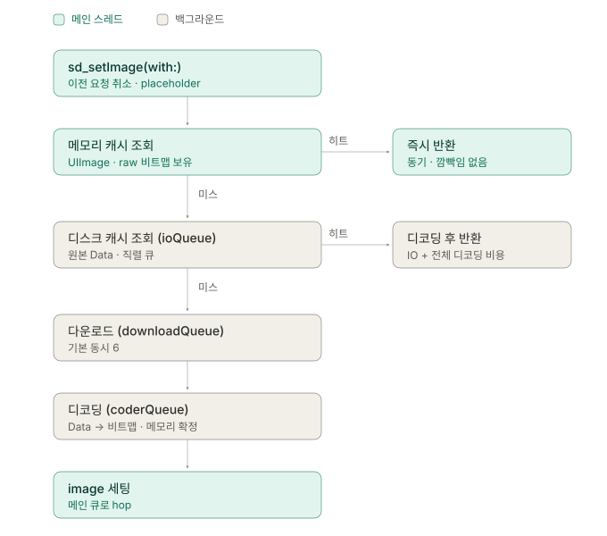

# SDWebImage 내부 동작

`sd_setImage` 한 줄을 호출했을 때, 어디서 스레드가 바뀌고 어디서 메모리가 늘어나는가?

| 단계 | 내용 | 상태 |
|---|---|---|
| 1 | 요청 한 건의 전체 경로 | ✅ |
| 2 | 메모리 캐시와 디스크 캐시 | ✅ |
| 3 | 디코딩과 다운샘플링 | ✅ |
| 4 | 셀 재사용과 이미지 섞임 | ✅ |

기준 버전은 SDWebImage 5.x. 4.x는 디코딩 정책과 thumbnail 관련 구조가 다르다.

전제로 두고 가는 내용은 [UIImage와 이미지 메모리](uikit-uiimage-memory.md)에 있다.

---

## 1. 요청 한 건의 전체 경로

> 메모리 히트만 동기다. 나머지는 전부 비동기고, 그 차이가 화면에 그대로 보인다.

### 계층 구조

| 층 | 타입 | 책임 |
|---|---|---|
| View | `UIView+WebCache` | 이전 요청 취소, placeholder, 최종 이미지 세팅 |
| 조율 | `SDWebImageManager` | 캐시 키 계산, 캐시 → 로더 순서 제어 |
| 캐시 | `SDImageCache` | 메모리(`SDMemoryCache`) + 디스크(`SDDiskCache`) |
| 로더 | `SDWebImageDownloader` | NSOperationQueue + URLSession |

Manager는 캐시도 네트워크도 직접 하지 않는다. `SDImageCacheProtocol`과 `SDImageLoaderProtocol`만 알고 있어 구현을 갈아끼울 수 있다.

### 실행 경로



### 메모리 히트는 완전히 동기다

메모리에서 찾으면 completion을 그 자리에서 호출하고 `nil` operation을 반환한다. `sd_setImage` 호출이 리턴되기 **전에** 이미 `imageView.image`가 채워져 있다.

카드 스와이프에서 다음 카드가 메모리 캐시에 있으면 placeholder가 한 프레임도 안 보인다. 메모리 미스면 최소 한 프레임은 노출된다. 프리페치는 **디스크가 아니라 메모리까지** 올려놔야 무깜빡임이 된다.

### 디코딩이 메인 스레드에서 일어나지 않는다

`coderQueue`에서 미리 비트맵 컨텍스트에 그려버린다(force decode). 메인 스레드에 도착하는 UIImage는 이미 raw 비트맵을 들고 있어 CoreAnimation 커밋 때 할 일이 없다.

네트워크 캐싱은 URLCache로도 되지만, 메인 스레드 디코딩 회피는 직접 짜야 한다. **SDWebImage를 쓰는 가장 큰 이유가 이것.** 대가는 메모리에 raw 비트맵이 그대로 올라간다는 점.

### 취소는 뷰 단위로 걸린다

`UIView`에 associated object로 `operationKey → operation` 딕셔너리를 달아두고, 같은 키로 새 요청이 오면 이전 것을 취소한다. 기본 키는 클래스 이름(`UIImageView`).

### 정리

- 메모리 히트만 동기, 디스크·네트워크는 최소 한 프레임 placeholder 노출
- SDWebImage의 핵심 가치는 네트워크 캐싱이 아니라 메인 스레드 디코딩 회피
- 그 대가로 메모리에는 raw 비트맵이 그대로 올라간다
- 취소는 뷰에 붙어 있고 기본 키는 클래스 이름

---

## 2. 메모리 캐시와 디스크 캐시

> 메모리에는 UIImage, 디스크에는 원본 Data. 최적화 대상이 다르다.

| | 저장 형태 | 최적화 대상 |
|---|---|---|
| 메모리 | `UIImage` (raw 비트맵 보유) | 그리기까지의 시간 |
| 디스크 | 원본 `Data` (내려받은 압축 바이트) | 공간 + 원본 보존 |

### 디스크가 Data인 이유

1. **재인코딩은 손실이다.** UIImage를 JPEG로 다시 쓰면 화질이 한 번 더 깎인다. 원본 바이트를 그대로 두면 이 문제가 없다.
2. **나중에 다르게 디코딩할 수 있다.** 같은 항목을 다음번엔 다른 크기로 다운샘플링할 수 있다. 3번 항목의 thumbnail이 이 성질에 얹혀 있다.
3. **형식을 캐시가 몰라도 된다.** WebP든 HEIC든 해석은 coder가 한다. 캐시 층은 바이트 뭉치만 다룬다.

> [!IMPORTANT]
> 디스크 히트는 싸지 않다. 파일 IO + 전체 디코딩이 다 일어난다. 디스크 캐시는 네트워크를 아끼는 장치지 렌더링을 빠르게 하는 장치가 아니다.

반대로 `storeImage`에 UIImage만 있고 Data가 없으면 디스크에 넣기 위해 **인코딩을 수행한다.** 저장이 공짜가 아니라 CPU를 쓴다.

### weak 메모리 캐시

`SDMemoryCache`는 `NSCache` 서브클래스인데 weak 캐시(`NSMapTable`)를 하나 더 달아뒀다.

메모리 경고가 오면 NSCache는 내용을 통째로 날린다. 그런데 화면에 떠 있는 이미지는 `imageView.image`가 붙들고 있어 **객체 자체는 살아 있다.** 이 상태에서 다시 접근하면 멀쩡히 살아 있는 비트맵을 두고 디스크에서 다시 읽어 다시 디코딩하게 된다.

weak 캐시는 강한 참조를 놓아도 테이블에 남기므로 IO 없이 회수된다. 아무도 안 붙들면 자동으로 사라져 메모리를 새로 먹지도 않는다.

- 스위치: `SDImageCacheConfig.shouldUseWeakMemoryCache` (기본 `YES`)

### cost와 제거 정책의 한계

메모리 캐시 cost는 `image.sd_memoryCost` — 대략 `bytesPerRow × height`, 애니메이션이면 × 프레임 수. 파일 크기가 아니라 비트맵 실제 점유량이다.

`maxMemoryCost` 기본값은 `0` = 무제한. 즉 기본 설정은 총량 제한 없이 NSCache의 시스템 압박 제거에만 맡긴다.

NSCache의 제거 정책은 문서화된 LRU가 아니다. 무엇이 언제 빠지는지 보장이 없다. **"N장은 반드시 유지"가 필요한 화면이라면 앱 쪽에서 직접 strong으로 들고 있어야 한다.**

### ioQueue는 직렬이다

디스크 읽기/쓰기는 전부 하나의 직렬 큐에서 처리된다. 다운로드는 6개가 병렬로 도는데 디스크는 1개씩이다. 콜드 스타트 직후 여러 장이 동시에 요청되면 디스크 읽기가 한 줄로 선다 — "캐시가 있는데도 첫 진입이 느리다"의 실체.

### 정리

- 메모리 = 시간 최적화, 디스크 = 공간·원본 최적화
- 디스크 히트는 IO + 전체 디코딩 → 메모리 히트와 비용 등급이 다르다
- Data 없이 UIImage만 저장하면 디스크 쓰기에 인코딩 비용이 붙는다
- weak 캐시는 "살아 있는데 캐시에서만 빠진" 이미지를 재디코딩에서 구제한다
- 메모리 총량은 기본 무제한, 제거 순서는 보장 없음 → 유지가 필요하면 앱이 직접 잡는다
- ioQueue가 직렬이라 디스크 히트는 동시에 처리되지 않는다

---

## 3. 디코딩과 다운샘플링

> 판단 지점은 하나. 메모리에 픽셀을 몇 개 올릴 것인가.

### 기본 동작이 이미 메모리를 쓴다

force decode 시점에 메모리가 **원본 픽셀 수 기준으로** 확정된다. `imageView.frame`은 아무 영향이 없다.

3000×2000 JPEG, 파일 820KB를 340×214pt(@3x)로 표시하는 경우:

| 시점 | 메모리 | 비고 |
|---|---|---|
| Data | 820KB | 디스크 캐시가 저장하는 것 |
| 디코딩 후 (크기 안 알려줌) | **24MB** | 3000 × 2000 × 4 |
| 실제 화면에 쓰이는 양 | 2.6MB | 1020 × 642 × 4 |
| 낭비 | **21.4MB** | 한 번도 화면에 안 나옴 |

820KB → 24MB, 약 29배. 배율은 압축률에 따라 달라지므로 **파일이 작다는 건 안심할 근거가 못 된다.** 카드 스택에 5장이면 120MB.

### 해법: thumbnail context

```swift
let scale = UIScreen.main.scale
let targetPixel = CGSize(width: 340 * scale, height: 214 * scale)

cardImageView.sd_setImage(
    with: url,
    placeholderImage: placeholder,
    context: [
        .imageThumbnailPixelSize: targetPixel,
        .imagePreserveAspectRatio: true
    ]
)
```

내부적으로 `CGImageSourceCreateThumbnailAtIndex`를 쓴다. 24MB를 만들었다가 줄이는 게 아니라 **24MB짜리가 메모리에 존재한 적이 없다.** 위 예시면 24MB → 2.6MB.

나중에 `imageView.image`를 받아 리사이즈하는 건 이 문제를 못 푼다. 이미 24MB를 쓴 뒤라 순간 최대 메모리는 그대로고, 리사이즈 중엔 원본과 결과가 둘 다 떠 있다. **디코딩 전에 말해야** 의미가 있다.

> [!IMPORTANT]
> 단위는 pt가 아니라 **픽셀**이다. `× UIScreen.main.scale`을 빼먹으면 3배 흐린 이미지가 나온다.

- 네트워크는 안 줄어든다. 원본을 그대로 다 내려받는다. 트래픽까지 줄이려면 서버 리사이즈 엔드포인트가 필요하다.
- 캐시 키에 thumbnail 크기가 반영된다. 같은 URL이라도 크기가 다르면 별도 항목으로 캐싱된다.

### 옵션별 판단

| 옵션 | 메모리 | 메인 스레드 | 쓸 자리 |
|---|---|---|---|
| 기본 (force decode) | 원본 픽셀 × 4 | 안 씀 | 이미지가 작을 때 |
| `.imageThumbnailPixelSize` | 표시 크기 × 4 | 안 씀 | **원본이 표시 크기보다 클 때 = 대부분** |
| `SDWebImageAvoidDecodeImage` | 압축 상태 유지 | **씀** | 사실상 없음 |
| `SDWebImageScaleDownLargeImages` | 상한선까지만 | 안 씀 | 크기를 모를 때의 안전망 |

`AvoidDecodeImage`는 force decode를 건너뛰어 디코딩을 렌더링 시점 메인 스레드로 되돌린다. SDWebImage를 쓰는 이유를 스스로 꺼버리는 옵션이라 스크롤·애니메이션이 도는 화면에서는 쓰지 않는다.

`ScaleDownLargeImages`는 일정 바이트를 넘는 이미지만 자동으로 줄이는 무딘 안전망. 표시 크기를 아는 상황에서는 thumbnail이 항상 낫다.

### 정리

- 메모리를 결정하는 건 원본 픽셀 수. `frame`은 무관
- 메모리를 줄이면서 대가가 없는 방법은 thumbnail 하나뿐
- thumbnail은 디코딩 메모리만 줄인다. 네트워크는 그대로
- 받아서 리사이즈하는 건 해결이 아니다. 디코딩 전에 크기를 알려야 한다
- `AvoidDecodeImage`는 디코딩을 메인 스레드로 되돌린다

---

## 4. 셀 재사용과 이미지 섞임

> 뷰를 모르는 게 아니라, 그 뷰가 지금 무엇을 담당하는지를 모른다.

### 원인

```
t0  cell A 등장 → URL_1 요청 (네트워크, 800ms)
t1  스크롤 → 같은 cell 객체가 B로 재사용 → URL_2 요청 (메모리 히트, 0ms)
t2  URL_2 이미지 세팅
t3  URL_1 응답 도착 → 같은 imageView에 세팅   ← B 자리에 A 이미지
```

클로저가 `imageView`를 캡처하고 있으므로 **어느 뷰에 그릴지는 확실히 안다.** 모르는 건 그 뷰가 여전히 같은 데이터를 담당하는지다. 셀 재사용은 뷰 객체를 유지한 채 담당 데이터만 바꾸기 때문이다.

이 구분이 처방을 가른다. `weak`은 이 버그를 못 고친다. 셀은 재사용되므로 살아 있고 weak 참조도 유효하다. `weak`은 생명주기 방어고, 실제 해결책은 **데이터 비교**다.

### 기본 방어선

`sd_setImage`의 첫 동작이 이전 요청 취소이므로 위 시나리오는 기본 경로에서는 일어나지 않는다. 취소된 operation은 완료 콜백에서 이미지를 세팅하지 않는다. 완료 시점에 주인을 확인하는 대신 **애초에 살아남지 못하게** 만든 구조.

셀 안에 이미지뷰가 여러 개여도 각각 별개의 뷰이므로 각자 자기 딕셔너리를 갖는다.

### 뚫리는 곳

**Manager 직접 호출** — 뷰 카테고리를 안 거치면 취소 장치가 없다.

```swift
// 취소 안 됨. 섞임
SDWebImageManager.shared.loadImage(with: url, options: [], progress: nil) { image, _, _, _, _, _ in
    cell.cardImageView.image = image
}
```

**completion 안에서 셀 바깥을 건드리는 경우** — 뷰모델 상태, 부모 레이아웃, 애니메이션 트리거는 취소 대상이 아니었던 별개 로직이라 순서가 꼬인다.

**placeholder 미지정 시 잔상** — 섞인 게 아니라 이전 이미지가 그대로 남는다. 메모리 히트면 순간 교체돼 안 보이고 디스크·네트워크면 보이므로 "가끔만 이상하다"로 리포트된다.

### 처방

```swift
override func prepareForReuse() {
    super.prepareForReuse()
    cardImageView.sd_cancelCurrentImageLoad()
    cardImageView.image = nil          // 잔상 제거
}
```

Manager 직접 호출이 불가피하면 데이터로 검증한다.

```swift
let requestedURL = card.imageURL
SDWebImageManager.shared.loadImage(with: requestedURL, ...) { [weak cell] image, _, _, _, _, _ in
    guard let cell, cell.currentImageURL == requestedURL else { return }
    cell.cardImageView.image = image
}
```

> [!IMPORTANT]
> 검증 기준을 indexPath로 잡지 않는다. 카드 순서 변경처럼 드래그 재배열이 있는 화면에서는 로드 중에 indexPath가 바뀐다. 위치는 변해도 카드 ID/URL은 안 변하므로 검증은 **데이터 식별자**로 한다.

### 이건 이미지 문제가 아니다

셀 재사용 + 비동기면 같은 버그가 나온다. 대상이 이미지가 아니어도 마찬가지다.

```swift
api.fetchCardBalance(cardID) { balance in
    cell.balanceLabel.text = balance   // 이 셀이 아직 그 카드인가?
}
```

이쪽은 자동 취소 장치가 없으니 직접 막지 않으면 그냥 뚫린다.

> 재사용되는 뷰에 비동기 결과를 쓸 때는, 쓰기 직전에 그 뷰의 현재 담당 데이터를 확인해야 한다.

`sd_setImage`가 막아주는 건 이 원칙의 한 가지 적용 사례일 뿐이다.

### 정리

- 원인은 뷰를 잃은 게 아니라 뷰의 담당 데이터가 바뀐 것
- `weak`은 생명주기 방어일 뿐, 해결책은 데이터 비교
- 기본 경로는 뷰당 operation 취소로 안전
- 뚫리는 곳은 Manager 직접 호출, completion 안의 부수효과, placeholder 미지정 잔상
- `prepareForReuse`에서 취소 + `image = nil`이 가장 싼 보험
- 수동 검증은 indexPath가 아니라 데이터 식별자로

---

## 미확인 사항

- 지역화폐 프로젝트에 설치된 SDWebImage 실제 버전 미확인. 이 노트는 5.x 기준이며 4.x는 디코딩 정책과 thumbnail 구조가 다르다.
- `NSCache`의 제거 정책이 LRU인지 문서화된 보장이 없다. 시뮬레이터와 실기기 동작이 다를 수 있다는 것까지만 확인.
- 캐시 키 생성 규칙과 `cacheKeyFilter`, transformer 적용 시 원본/변형본 저장 구조 — 이번 범위에서 제외.
- 다운로드 큐 내부 동작(우선순위, 중복 요청 병합) — 이번 범위에서 제외.
- 디스크 캐시 만료 정책과 용량 관리 — 이번 범위에서 제외. 서버 이미지가 자주 갱신되는 요구가 생기면 다시 볼 것.
