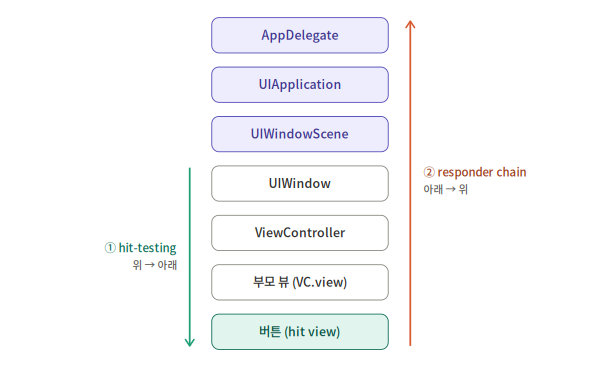

# RunLoop, Hit-Testing, Responder Chain

> 작성일: 2026-09-29

## A. RunLoop: 앱이 "살아 있는" 방식

```swift
// 개념 설명용 의사코드 (실제 구현은 CFRunLoop, C 레벨)
while appIsRunning {
    let event = sleepUntilSomethingHappens()  // 할 일 없으면 CPU를 안 쓰고 잠듦
    handle(event)                              // 터치, 타이머, 시스템 메시지 처리
    updateUIIfNeeded()                         // 이번 턴에 바뀐 UI를 한꺼번에 반영
}
```

1. 할 일이 없으면 잠든다 → 앱이 가만히 있을 때 배터리를 안 먹는 이유
2. 한 바퀴 = 한 턴 → 이 턴 안에서 처리가 끝나야 다음 이벤트(다음 터치, 화면 갱신)로 넘어감

"UI 작업은 메인 스레드에서, 무거운 작업은 백그라운드에서" → 메인 스레드에서 3초짜리 동기 작업을 하면, RunLoop가 그 한 턴에서 3초간 갇힌다

### RunLoop Mode - 스크롤하면 타이머가 멈추는 이유

RunLoop는 모드를 바꿔가며 돌고, 각 이벤트 소스는 특정 모드에 등록됨. 해당 모드일 때만 처리된다.

- `.default` - 평상시 / `Timer.scheduledTimer`의 기본 등록 모드
- `.tracking` - 스크롤 등 터치 추적 중 / UIScrollView가 드래그 중 이 모드로 전환
- `.common` - 위 둘을 묶은 "가상 모드" / 여기 등록하면 양쪽 모두에서 동작

```swift
// ❌ 스크롤하는 동안 카운트다운이 멈춤 (.default 모드에만 등록됨)
Timer.scheduledTimer(withTimeInterval: 1, repeats: true) { _ in
    self.updateCountdown()
}

// ✅ 스크롤 중에도 동작
let timer = Timer(timeInterval: 1, repeats: true) { _ in
    self.updateCountdown()
}
RunLoop.main.add(timer, forMode: .common)
```

Apple이 스크롤 중엔 다른 걸 잠시 미루는 설계를 한 이유는 스크롤의 부드러움을 최우선으로 두기 위해서이다.

## B. Hit-Testing: "누가 이 터치를 받을까?"

### 터치가 전달되는 경로

터치는 하드웨어 → 시스템 프로세스 → 앱의 RunLoop로 들어옴

```
UIApplication.sendEvent(_:)
  → UIWindow.sendEvent(_:)
    → hit-testing으로 찾은 "가장 안쪽 뷰"에 전달
```

### Hit-Testing 알고리즘

윈도우부터 시작해서 이 좌표를 포함하는 가장 깊은 뷰를 재귀로 찾는다.

```swift
// UIView.hitTest의 동작을 풀어쓴 개념 코드
override func hitTest(_ point: CGPoint, with event: UIEvent?) -> UIView? {
    // 1. 터치를 받을 수 없는 상태면 탈락
    guard isUserInteractionEnabled, !isHidden, alpha > 0.01 else { return nil }
    // 2. 좌표가 내 영역 밖이면 탈락
    guard self.point(inside: point, with: event) else { return nil }
    // 3. 자식 뷰를 "맨 앞(마지막으로 추가된 것)부터" 검사
    for subview in subviews.reversed() {
        let converted = subview.convert(point, from: self)
        if let hit = subview.hitTest(converted, with: event) {
            return hit   // 자식이 받으면 그 자식이 주인
        }
    }
    // 4. 어떤 자식도 안 받으면 내가 주인
    return self
}
```

### 실무 증상

| 증상 | 원인 (위 코드의 몇 번?) |
|---|---|
| 버튼이 부모 뷰 밖으로 삐져나온 부분은 안 눌림 | **2번** — 부모가 먼저 탈락해서 자식까지 내려가지 않음. `clipsToBounds`와 무관 |
| `alpha = 0`인 투명 뷰로 터치 막기가 안 됨 | **1번** — 0.01 이하는 hit-test 대상 제외. 투명하게 막으려면 `backgroundColor = .clear` 사용 |
| `UIImageView` 위 버튼이 안 눌림 | **1번** — `UIImageView`, `UILabel`은 `isUserInteractionEnabled` 기본값이 `false` |
| 위에 덮인 뷰가 터치를 가로챔 | **3번** — 앞에 있는 형제 뷰가 먼저 검사됨 |

## C. Responder Chain: "처리 못 하면 누구에게 넘길까?"

Hit-Testing이 위에서 아래로 내려가며 주인을 찾는다면, Responder Chain은 주인이 처리 못 한 이벤트를 아래에서 위로 올려 보내는 경로이다.



```swift
extension UIResponder {
    func printResponderChain() {
        var responder: UIResponder? = self
        while let current = responder {
            print("→", type(of: current))
            responder = current.next
        }
    }
}

// 버튼 액션 안에서
sender.printResponderChain()
// → UIButton → UIView → MyViewController → UIWindow → UIWindowScene → UIApplication → AppDelegate
```

### AppDelegate가 왜 UIResponder를 상속하나

Responder Chain의 마지막 정거장으로 만들기 위해서

### 실무에서 Responder Chain이 쓰이는 곳

#### ① First Responder와 키보드

"First Responder"는 체인의 출발점이 되는 현재 포커스 객체

```swift
textField.becomeFirstResponder()   // 키보드 올리기
textField.resignFirstResponder()   // 키보드 내리기
view.endEditing(true)              // 호출한 뷰의 범위 안에서 first responder를 찾아 사임시킴
```

#### ② target이 nil인 액션: 체인을 타고 올라가며 처리자 탐색

누가 first responder인지 몰라도 "처리할 수 있는 누군가"에게 보낼 수 있다.

```swift
// 현재 포커스가 어디든 키보드 내리기
UIApplication.shared.sendAction(
    #selector(UIResponder.resignFirstResponder),
    to: nil,      // ← nil이면 first responder부터 체인을 따라 올라가며 처리자를 찾음
    from: nil,
    for: nil
)
```

위 예시는 first responder가 `resignFirstResponder`를 바로 가지고 있어서 첫 단계에서 끝난다. 체인을 타고 올라가는 경우는 아래와 같다.

```swift
// 툴바 안의 저장 버튼: VC를 모르므로 target에 nil
saveButton.addTarget(nil, action: #selector(DocumentActions.saveDocument(_:)), for: .touchUpInside)
```

```
① textView (first responder) → saveDocument 있어? ❌ → next로
② view (VC의 루트 뷰)         → saveDocument 있어? ❌ → next로
③ EditorViewController      → saveDocument 있어? ✅ → 여기서 호출하고 종료
```

- 처음으로 "있다"고 답한 객체가 처리하고 거기서 멈춘다
- 처리자가 아무도 없으면 **크래시도 에러도 없이 조용히 무시**된다 → 구현 누락을 컴파일러가 못 잡음

## 셀프 체크

**Q1. 스크롤 중에 Timer 기반 카운트다운이 멈췄다. 원인과 해결책은?**\
: `.default`와 `.tracking`을 모두 포함하는 `.common` 모드에 등록한다.

**Q2. 부모 뷰 밖으로 튀어나온 버튼 영역이 안 눌린다. hit-test 알고리즘의 어느 단계 때문인가?**\
: 2단계 `point(inside:)` 검사에서 부모 뷰가 먼저 탈락하기 때문이다. hit-test는 위에서 아래로 내려간다. 부모가 "터치가 내 영역 밖"이라며 nil을 반환하면 3단계(자식 검사)로 내려가지 않으므로, 버튼은 검사될 기회조차 없다.

**Q3. AppDelegate가 UIResponder를 상속하는 이유는?**\
: Responder Chain의 마지막 정거장이 되기 위해서다. 체인을 끝까지 올라가도 아무도 처리하지 않은 이벤트나 액션을 AppDelegate가 처리할 수 있다.\
보충: `NSObject`만 상속해도 앱은 정상 동작한다. Responder Chain에서 빠질 뿐이므로, 필수가 아니라 "마지막 처리 기회를 갖기 위한 선택"이다.
